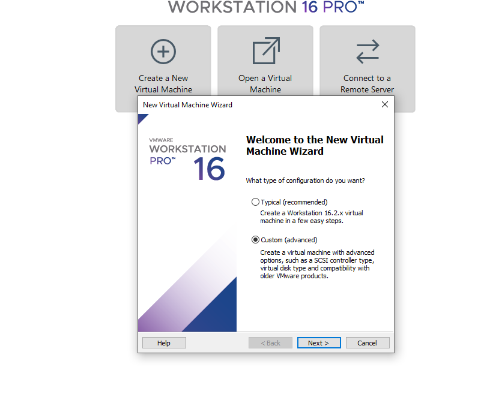
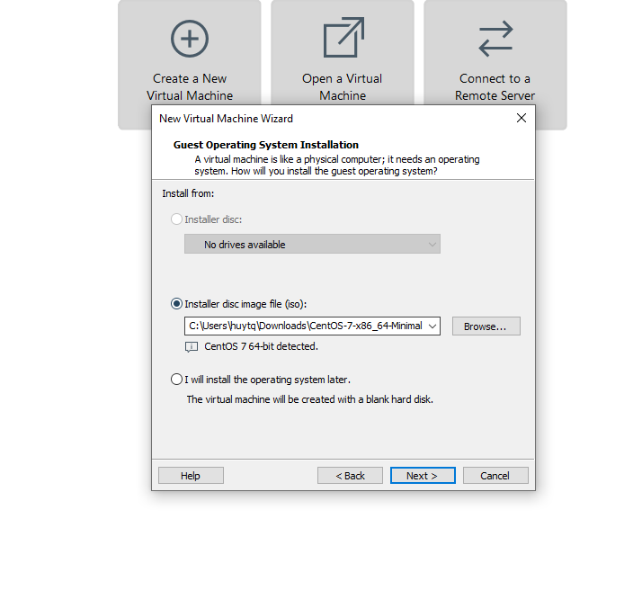
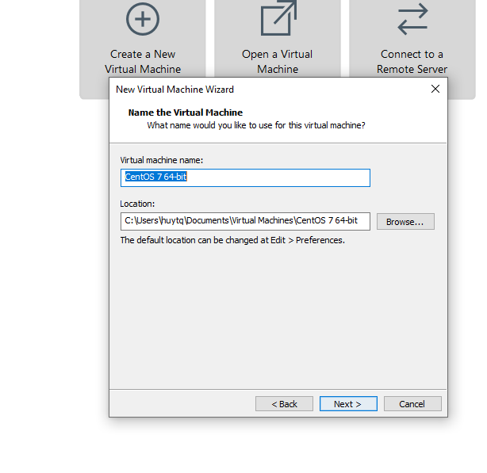
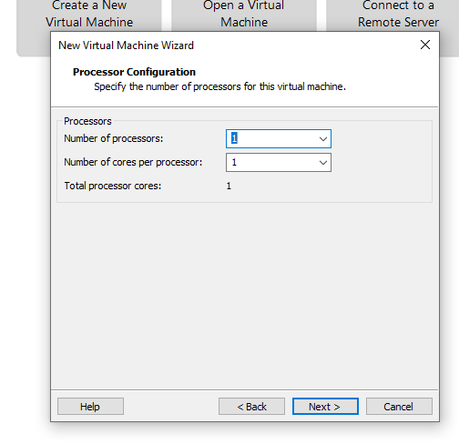
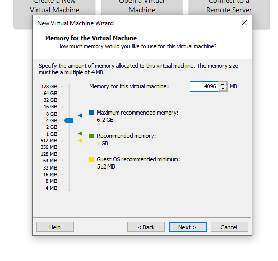
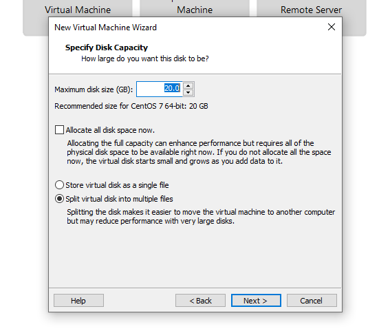
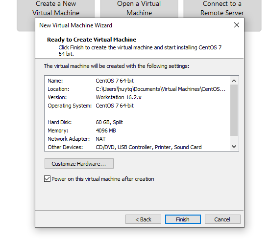

# Cài đặt Centos 7-minimal 

### Các bước thực hiện 

- Mở VMware workstation lên. Chọn **Creat a new Virtual Machine**. Xuất hiện cửa sổ chọn option tùy thích sau đó chọn Next.(ở đây chọn Custom). 
   
    
   
- Tiếp tục bấm **Next** cho đến khi xuất hiện hộp thoại sau: 

    

tại đay chọn đường dẫn `.iso` của Centos 7-minimal. Sau đó chọn Next.

- Đặt tên cho máy ảo sau đó bấm **Next**.

    
   
- Chọn số lượng Process. Tiếp tục chọn **Next**.

    

- Chọn bộ nhớ là 4Gb. Bấm **Next**.

    

- Tiếp tục bấm **Next** theo mặc định. Cho đến khi xuất hiện hộp thoại sau.

    
   
   tại đay chọn size của ổ đĩa(ở đây chọn 60Gb). Tiếp tục bấm **Next**. Đến khi hộp thoại cuối cùng xuất hiện bấm **Finish**.
   
    
   
-   
