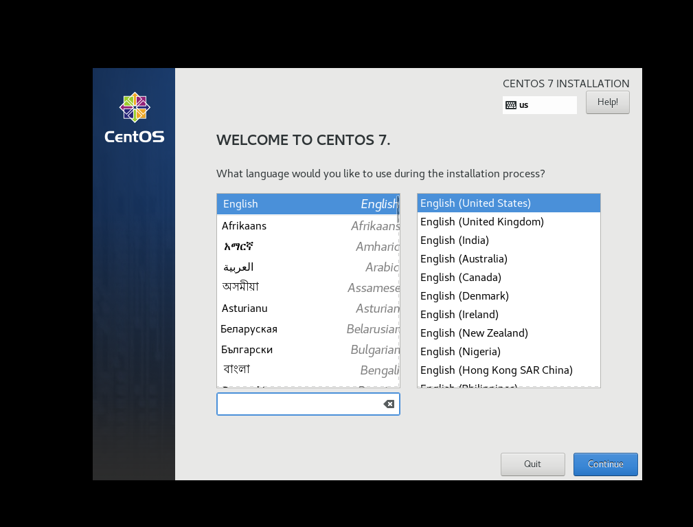
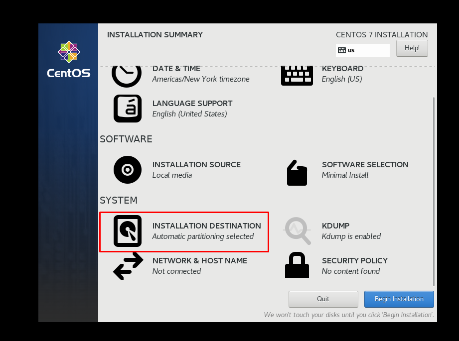
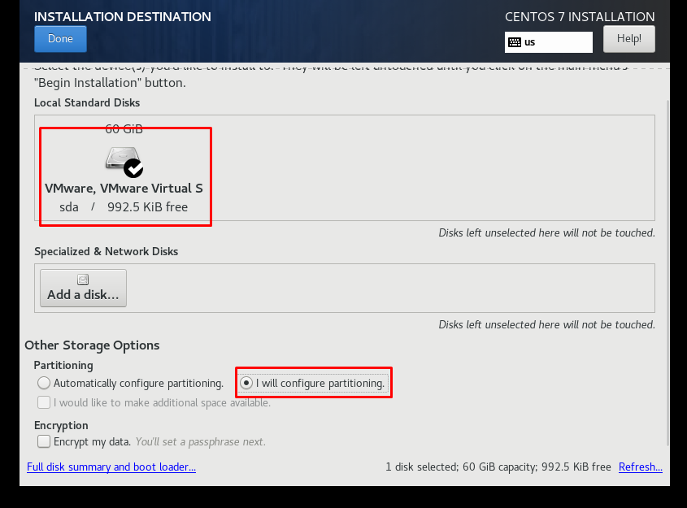
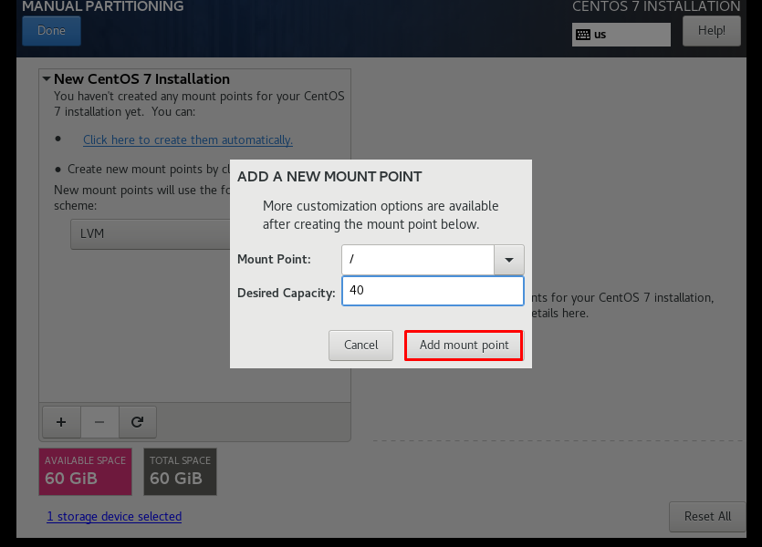
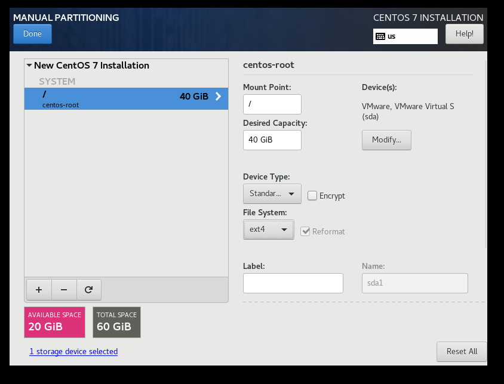
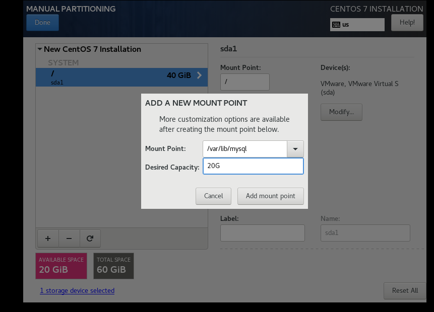
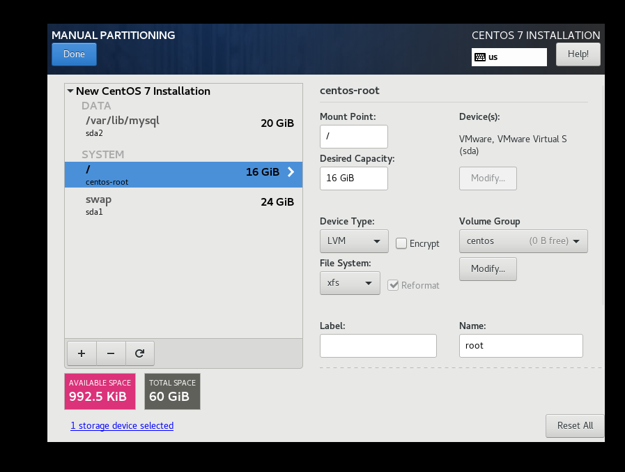
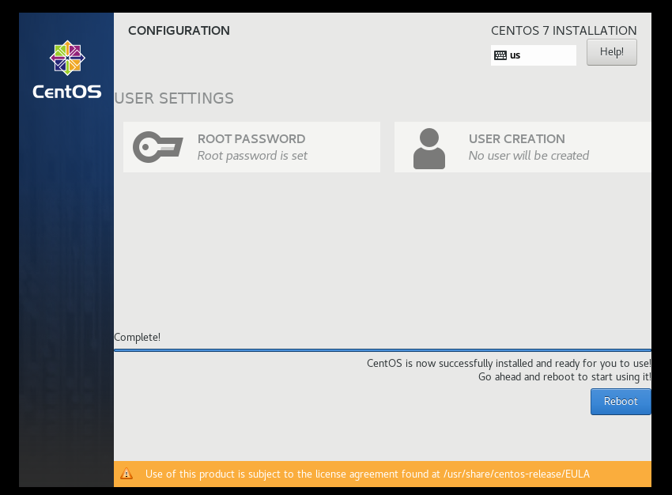
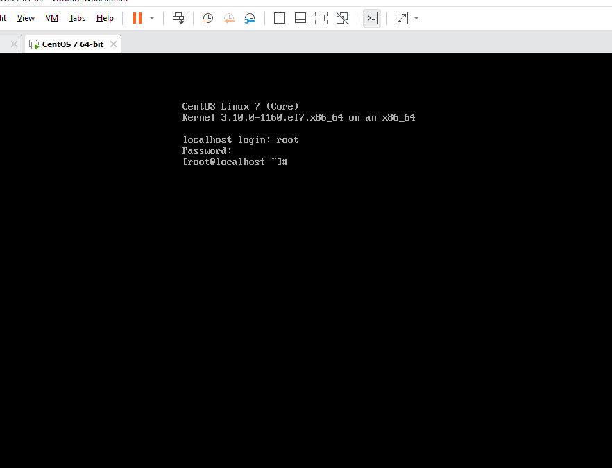

# Cài đặt Centos 7-minimal 

### Các bước thực hiện 

- Mở VMware workstation lên. Chọn **Creat a new Virtual Machine**. Xuất hiện cửa sổ chọn option tùy thích sau đó chọn Next.(ở đây chọn Custom). 
   
    
   
- Tiếp tục bấm **Next** cho đến khi xuất hiện hộp thoại sau: 

    

tại đay chọn đường dẫn `.iso` của Centos 7-minimal. Sau đó chọn Next.

- Đặt tên cho máy ảo sau đó bấm **Next**.

    
   
- Chọn số lượng Process. Tiếp tục chọn **Next**.

    

- Chọn bộ nhớ là 4Gb. Bấm **Next**.

    

- Tiếp tục bấm **Next** theo mặc định. Cho đến khi xuất hiện hộp thoại sau.

    
   
   tại đay chọn size của ổ đĩa(ở đây chọn 60Gb). Tiếp tục bấm **Next**. Đến khi hộp thoại cuối cùng xuất hiện bấm **Finish**.
   
    
   
- Sau 1 khoảng thời gian. Ta setup máy ảo. Đầu tiên chọn ngôn ngữ.

   

- Tiếp theo phân vùng ổ đĩa. Chọn như hình bên dưới.
   
   
   
 - Sau đó kích vào ổ đĩa và kích vào option như hình dưới, sau đó bấm **Done**.
 
   
   
 - Tại cửa sổ mới bấm vào dấu **+**. Sau đó điền thông số cần setup.
 
   
   
- Chọn option như sau:

   

- Add thêm 1 ổ nữa với đường dẫn như sau và chọn option như bên trên:
 
   

- Sau khi chọn xong, ta có hình dưới đây.

   
   
- Sau đó bấm **Done** và chọn **Accept all**. Và tiếp theo chọn **Begin Installing**.
- Đợi 1 khoảng thời gian để cài đặt. Sau khi cài xong chọn **Reboot** để khởi động lại.
 
   
   
- Nhập localhost login và password là hoàn thành, 

   

