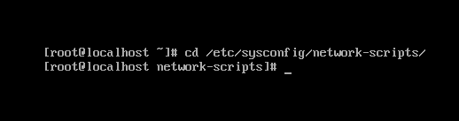
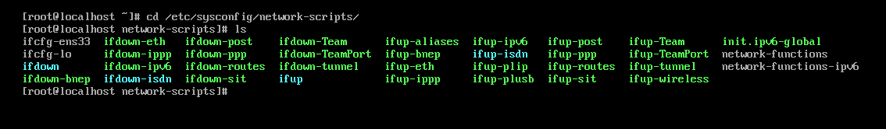
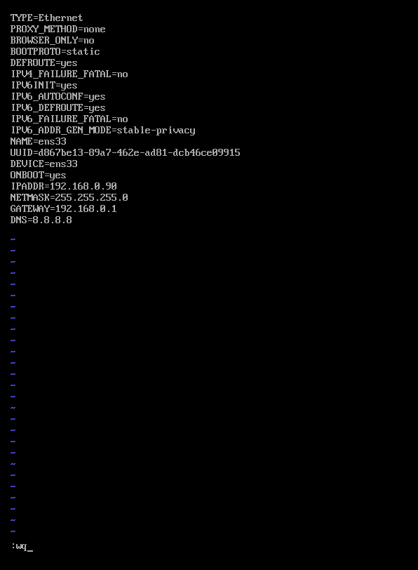
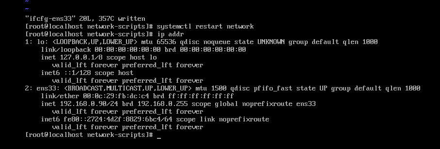

# Cấu hình ip ens33: 192.168.0.90/24 

  - Sau khi login hệ thống chúng ta vào thư mục sau: `/etc/sysconfig/network-scripts/`  bằng lệnh:

    `cd /etc/sysconfig/network-scripts/`
    
      
      
  - Nhập lệnh `ls` để lấy danh sách các file và thư mục.
      
      
      
  - Ở đây chúng ta cần cấu hình cho **ifcfg-ens33** nên ta sử sụng lệnh `vi ifcfg-ens33` để chỉnh cấu hình và có kết quả sau:

      
   
  - Sau đó khởi động lại bằng lệnh `systemctl restart network.service`. Sau đó kiểm tra cấu hình bằng lệnh `ip addr`.
      
      
        
  - Như vậy là đã hoàn thành xong.
      
