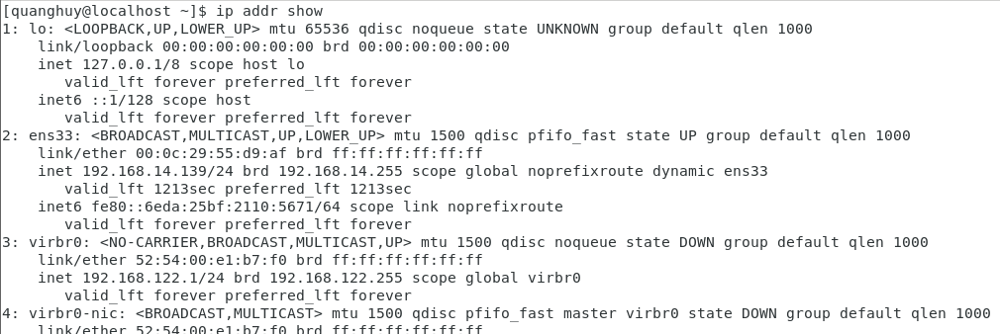
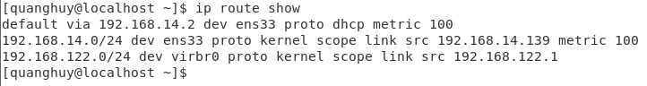
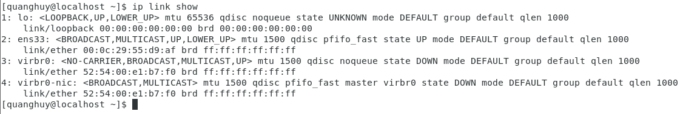

# Cơ bản về Network 

   1. **Network interface**
     
       - Network interface (Giao diện mạng) là kênh kết nối giữa thiết bị vầ mạng. Bạn có thể có nhiều interface hoạt động cùng lúc, các interface có thể được kích hoạt (activated) hoặc bỏ kích hoạt (de-activated).
       - Về mặt vật lý, giao diện mạng có thể tiến hành thông qua thẻ giao diện mạng (NIC) hoặc có thể được triển khai trừu tượng hơn dưới dạng phần mềm.
       - File cấu hình network ở những nơi khác nhau tùy vào mỗi nền tảng:

          + Debian: /etc/network/interfaces
          + CentOS: /etc/sysconfig/Network-scripts/
          + SUSE: /etc/sysconfig/network
   
   2. **Lệnh IP**
   
       - Lệnh trả lại thông tin trên từng thiết bị Ethernet được kết nối.
     
        
     
        - Hiển thị bảng định tuyến.
   
        
      
       - Hiển thị thông tin về một giao diện mạng.
        
        
      
      
      
    
     
