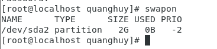
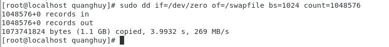
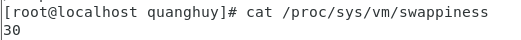

# Swap Memory

## 1. Swap Memory là gì?

Swap Memory được sử dụng khi hệ thống của bạn quyết định rằng nó cần thêm bộ nhớ RAM cho quá trình hoạt động và bộ nhớ RAM hiện tại không còn đủ để sử dụng. Nếu điều đó xãy ra, các tài nguyên và dữ liệu tạm thời không hoạt động trên bộ nhớ RAM sẽ được di chuyển để lưu trữ vào không gian Swap để giải phóng bộ nhớ RAM và sử dụng cho việc khác.

Lưu ý rằng thời gian truy cập vào vùng Swap là chậm hơn rất nhiều, do đó bạn không nên coi việc sử dụng Swap là một phương pháp thay thế cho (RAM).

## 2. Khi nào cần Swap Memory?
- **Tối ưu hóa bộ nhớ**: Hệ thống sẽ di chuyển các tài nguyên và dữ liệu hiện không được sử dụng trong bộ nhớ RAM đến Swap, điều này giúp hệ thống phục vụ cho các mục đích khác tốt hơn.

- **Tránh các trường hợp không lường trước**: Trong một số trường hợp, bạn không dự tính được bộ nhớ dành cho các chương trình mà bạn chuẩn bị thử nghiệm, hoặc một chương trình bất kỳ nào đó nổi điên lên, hoặc bất cứ điều gì đó bất thường.
 Linux Swap có hai dạng: phân vùng & File. Để xem nó nằm ở đâu, hãy sử dụng lệnh `swapon`:
  
    
 
## 3. Tạo file Swap
 - Tạo file sẽ dùng làm file Swap, tùy biến dung lượng 1G:
  `sudo fallocate -l 1G /swapfile`
  -Nếu hệ thống không có sẵn `fallocate`.Tạo Swap File:
    
     
    
## 4. Kiểm tra lại vùng swap
  - Kiểm tra bằng lệnh `sudo dd if=/dev/zero of=/swapfile bs=1024 count=1048576`.
    
     
  

## 5. Giá trị Swappiness
  - Giá trị Swappiness từ 0 - 100, giá trị mặc định ở thiết bị của mình là 30, chỉ số này càng thấp thì máy Linux sẽ càng tránh sử dụng Swap file này, giá trị càng cao thì máy tính càng ưu tiên sử dụng, chúng ta có thể thay đổi giá trị này tại: /proc/sys/vm/swappiness
  
      

## 6. Xóa Swap File

Để xóa File swap có thể Deactive swap File:

`sudo swapoff -v /swapfile`

Xóa dòng khai báo swap

`/swapfile swap swap defaults 0 0 tại file /etc/fstab`

Cuối cùng để Xóa ta dùng lệnh rm

`sudo rm /swapfile`

## 7. Dung lượng cần thiết của bộ nhớ SWAP
   - Nếu bạn có bộ nhớ RAM ít hơn hoặc bằng 1Gb, bạn nên sử dụng Swap có kích thước tối thiểu là bằng với lượng RAM.

   - Đối với những hệ thống có dung lượng RAM lớn hơn 1Gb, nếu bạn muốn sử dụng chế độ ngủ đông (Hibernation) thì kích thước tối thiểu của Swap là bằng với lượng RAM. Nếu bạn không sử dụng chế độ ngủ đông thì kích thước tối thiểu của Swap là “round(sqrt(RAM))” và kích thước tối đa là gấp đôi lượng RAM. Có một nhược điểm khi bạn thiết lập kích thước của Swap quá lớn, đó là bạn đang lãng phí dung lượng ổ đĩa mặc dù Swap không được sử dụng.

   - Theo Ubuntu thì thời gian truy cập trên Swap sẽ chậm hơn 10³ so với trên RAM. Ví dụ, khi bạn sử dụng bộ nhớ đệm từ RAM chỉ mất 1 giây, trong khi đó mất 15 phút khi sử dụng ổ cứng (HDD) và mất hơn 1 phút khi sử dụng ổ đĩa rắn (SSD). Vì vậy, nếu như bạn thiết lập kích thước của Swap là lớn hơn gấp hai lần lượng RAM thì tốt nhất là bạn nên tăng thêm lượng RAM.

  
  
  
    
  
