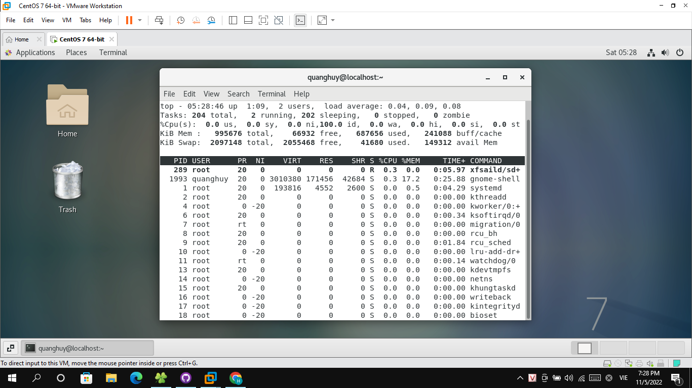
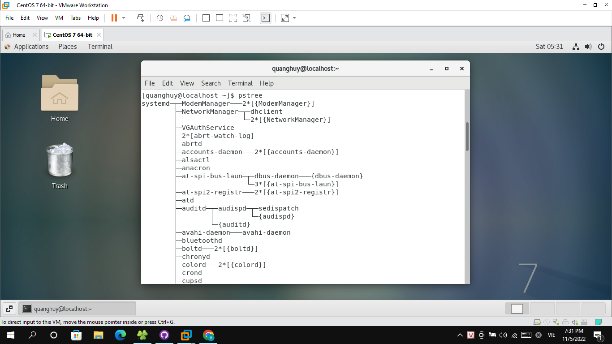

# Process

  - Để làm việc trên Unix, chúng ta tương tác với hệ điều hành thông qua các lệnh (*command*). Mỗi lệnh trên Unix khi thực thi sẽ **run** một *process* hoặc một group các *processes*.

## 1. Tổng quan
  - Tất cả các chương trình trong Unix thực chất đều là các *processes*: *terminal* bạn chạy, vim, hay bất cứ lệnh nào bạn gõ vào terminal. *Process* chính là đơn vị cấu thành nên Unix. Nói cách khác mỗi dòng code của bạn, sẽ được thực thi trên một *process*.
 

## 2. Unix cung cấp tool ps để list ra tất cả các process đang chạy trên hệ thống
  
   - Mình chạy lênh ps và show ra các thuộc tính `opid,ppid,user,rss,command` của `process`:
   - `ps -e -opid,ppid,user,rss,command`.
   - `ps` có rất nhiều option để chạy, nếu bạn muốn hiểu chỉ tiết, hãy sử dụng `man ps` để biết thêm
Ngoài ra lệnh ps cũng cho chúng ta thấy, mỗi một Process sẽ có một Process ID, và thuộc về một Process cha nào đó. Process ID là duy nhất đối với mỗi một process, tức là 2 process khác nhau chắc chắn phải có PID khác nhau. Ngoài ra Process ID là không thể thay đổi trong khi chạy process.

         
    
## 3. Có thể sử dụng lệnh top để xem live các process đang chạy

    - Dòng đầu tiên của top hiển thị một bản tóm tắt nhanh chóng về những gì đang xảy ra trong hệ thống :
      + Hệ thống đã hoạt động được bao lâu rồi
      + Có bao nhiêu người dùng đang đăng nhập
      + Trung bình tải
    - Dòng thứ hai của top hiển thị tổng số quá trình, số lượng quá trình chạy, ngủ, dừng và zombie. Nhằm đánh giá xem hệ thống có đang hoạt động hiệu quả hay không.
    
         
      
 ## 4. Sơ đồ pstree
  
    - Lệnh pstree hiển thị các quy trình đang chạy trên hệ thống dưới dạng sơ đồ cây thể hiện mối quan hệ giữa một quy trình và quy trình mẹ của nó và bất kỳ quy trình nào khác mà nó tạo ra. Các mục lặp lại của một quá trình không được hiển thị và các luồng được hiển thị trong dấu "{}".
        
         
      
## 5. Process ID    
  
   - Process ID được đánh số theo thứ tự tăng dần. Bắt đầu từ 0 và tăng dần lên khi tới giá trị maximum. Giá trị maximum của Process ID là có thể cấu hình được tùy vào từng hệ thống.
   - Trên Linux bạn có thể xem và thay đổi giá trị mặc định của Process ID maximum bằng cách thay đổi file /proc/sys/kernel/pid_max . Khi process ID tăng đến giá trị maximum value, hệ điều hành (OS) sẽ quay trở lại đánh số từ một giá trị cụ thế.
 
## 6. Process Resource
  
   - Process Resource chính là bộ nhớ mà Process sử dụng, không gian địa chỉ của các Process là riêng biệt, nhờ thiết kế này mà các Process là độc lập với nhau.
  
## 7. Forking
    
    - Làm sao một process có thể sinh ra các process khác. Linux cung cấp một công cụ tuyệt vời để làm việc này, đó chính là fork.

    - Process con được copy tất cả các memory từ process cha. Process con sẽ được kế thứa từ process cha các resource. Điều này có nghĩa là nếu trong process cha, bạn đã định nghĩa biến a, và gán giá trị cho nó, process con cũng có thể sử dụng biến đó. Tức là thế này, khi fork một process mới, bộ nhớ của process con và process cha vẫn là độc lập, nhưng hệ điều hành sẽ sử dụng cơ chế copy-on-wright (COW) để thực hiện việc đó. Tức là nếu process con không thay đổi các giá trị trong process cha, process con và process cha sẽ vẫn dùng chung bộ nhớ. Điều này làm cho các process con chỉ đọc, sẽ có memory rất nhỏ. Hay nói cách khác, UNIX cung cấp cho chúng ta một công cụ để chạy các multiprogram với một lượng resource vửa đủ.
 
## 8.Delaying processes

    - Đôi khi có những lệnh hay công việc bị trì hoãn hoặc đình chỉ, lệnh ngủ có thể được thực thi để đợi đến quãng thời gian chỉ định, đơn vị mặc định là giây.
      

