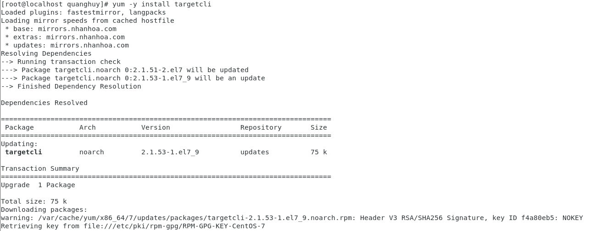
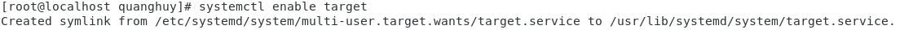
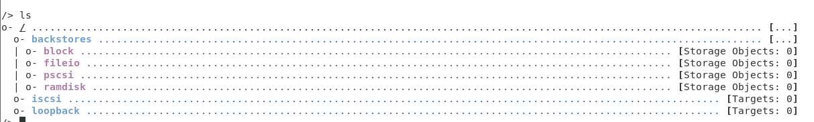

# iSCSI

## I. Tổng quan iSCSI

### 1. iSCCI là gì?

  - **iSCSI** là **Internet SCSI** (*Small Computer System Interface*) : là một giao thức cho phép truyền tải các lệnh SCSI qua mạng IP bằng cách sử dụng giao thức TCP/IP. Nó truy cập thiết bị lưu trữ theo dạng block-level là truy cập theo từng khối.

  - Lệnh iSCSI được đóng gói trong lớp TCP/IP và truyền qua mạng nội bộ LAN hoặc cả qua mạng Internet Public mà không cần quan tâm đến các thiết bị chuyện biệt như Fiber Channel, chỉ cần cấu hình đúng Gigabit ethernet và iSCSI.

  - iSCSI sử dụng không gian nhớ ảo như LUN trên linux, VHD’s trên windows, giảm chi phí vì sử dụng các thiết bị sẵn có như switch, hub, router, …

### 2. Thành phần của iSCSI

  - *iSCSI Inititor ( iSCSI Initiator Node)*: là thiết bị client trong kiến trúc hệ thống lưu trữ qua mạng. iSCSI Inititor sẽ kết nối đến máy chủ iSCSI Target và truyền tải các lệnh SCSI thông qua đường truyền mạng TCP/IP. iSCSI Inititor có thể được khởi chạy từ chương trình phần mềm trên OS hoặc phần cứng thiết bị hỗ trợ iSCSI.
  - *iSCSI Target( iSCSI Target Node)*: thường là một máy chủ lưutrữ có thể là hệ thống NAS. Từ máy chủ iSCSI Target sẽ tiếp nhận các request gửi từ iSCSI Inititor gửi đến và gửi trả dữ liệu trả về. iSCSI Target quản lý các ổ đĩa iSCSI với các tên gọi LUN ( Logical Unit Number) được sử dụng để chia sẻ ổ đĩa lưu trữ iSCSI với phía iSCSI Inititor (client).

## II. Cài đặt

### 1. Trên iSCSI Target

   - Cài đặt công cụ quản trị, cấu hình để luôn bắt đầu liên tục khi khởi động, sau đó khởi động lên
   `# yum -y install targetcli`
 
       
       
   - `# systemctl enable target`
  
       
      
   - `# systemctl start target`
   - Để khởi động, ta dùng lệnh `targetcli`, sau đó dùng `ls` để được 1 bố cục giao diện dạng cây.

       
        
   - **Tạo Backstore:**
      - Backstore cho phép hỗ trợ các phương thức lưu trữ đối tượng (store object) khác nhau trên máy cục bộ. Ta sẽ tạo một store object xác định các tài nguyên mà Backstore sẽ sử dụng. 
      - Những Backstores được hỗ trợ là : *block devices, files, pscsi and ramdisks*. Trong trường hợp này ta sẽ sử dụng "*Block devices*".
   - **Tạo iSCSI Target:**: 
      - Tạo iSCSI Target bằng tên được chỉ định:
      
        
        
   - **Configure cổng thông tin iSCSI:**
      - Cổng thông tin iSCSI là cổng địa chỉ IP, là nơi **iSCSI Target** lắng nghe các kết nối đến.
        
        
        
   - **Configure Access List:**
      - Tạo Access List cho mỗi bộ khởi tạo sẽ được kết nối với Target. Điều này thực thi xác thực khi bộ khởi tạo đó kết nối, chỉ cho phép các LUN được hiển thị với mỗi bộ khởi tạo.
      - Thông thường mỗi người khởi tạo có quyền truy cập độc quyền vào LUN. Tất cả những người khởi xướng đều có tên nhận dạng duy nhất IQN. Tên duy nhất IQN của người khởi tạo phải được biết để định cấu hình ACL. Đối với những `open-iscsi initiators`, điều này có thể được tìm thấy trong tệp.
      -  `/etc/iscsi/initiatorname.iscsi`.

   - **Configure  LUNs:**
      - Số đơn vị logic (LUN) là một số được sử dụng để xác định đơn vị logic, là thiết bị được xử lý bởi giao thức SCSI tiêu chuẩn hoặc giao thức **Storage Area Network** đóng gói SCSI, chẳng hạn như Fibre Channel hoặc chính iSCSI. Để cấu hình LUN, tạo LUN của các `storage objects` đã được tạo.
   - **Khởi động lại Target service:**
   
        
       
  ### 2. Trên iSCSI Initiator
    - Sau khi cấu hình iSCSI trên máy Target, ta cài công cụ quản trị cho Initiator:

      `yum -y install iscsi-initiator-utils`

    - Bộ khởi tạo iSCSI được tạo bởi hai dịch vụ: `iscsi` và `iscsid`, khởi động cả hai và cho phép bắt đầu khi khởi động hệ thống.
   
   
        
