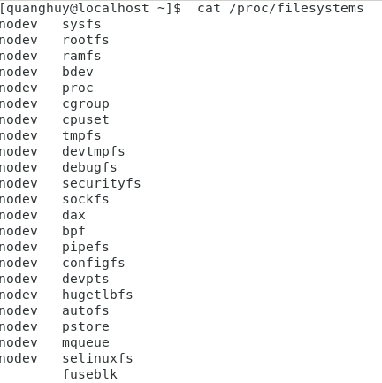

# Quản lý đĩa

 I. **Các thiết bị đĩa**
  
  1. **dmesg** 
   - Thông báo khởi động hạt nhân có thể được nhìn thấy sau khi khởi động bằng dmesg. Vì các thiết bị đĩa cứng 
được nhân phát hiện trong quá trình khởi động, bạn cũng có thể sử dụng dmesg để tìm thông tin về các 
thiết bị đĩa.
    
     
   
  2. **/ proc / scsi / scsi** 
   - Định vị thiết bị scsi thông qua cat / proc / scsi / scsi .
    
      
   
   
 II. **Phân vùng đĩa**
  
   1. **Về phân vùng**
   - Linux yêu cầu bạn tạo một hoặc nhiều phân vùng. Các đoạn tiếp theo sẽ giải thích cách để tạo và sử dụng phân vùng.
   - Hình dạng và kích thước của một phân vùng thường được xác định bởi một hình trụ bắt đầu và kết thúc (đôi khi theo lĩnh vực). Các phân vùng có thể thuộc loại chính (tối đa bốn), mở rộng (tối đa một) hoặc lôgic (chứa trong phân vùng mở rộng). Mỗi phân vùng có một nhập trường có chứa mã. Điều này xác định hệ điều hành máy tính hoặc
hệ thống tệp phân vùng.
   
       
  
   2. **Các phân vùng**
   - Tệp /proc/partitions chứa một bảng với số lượng phân vùng chính và phụ thiết bị, số khối của chúng và tên thiết bị trong / dev. Xác minh với / proc / devices để liên kết số chính với thiết bị thích hợp.
   
        
   
   - **df -h**: để hiển thị các phân vùng và kích thước hiện có.
     
        
     
 III. **Hệ thống tập tin**
  
   1. **Về hệ thống tệp** 
   - Hệ thống tệp là một cách sắp xếp các tệp trên phân vùng của bạn. Bên cạnh lưu trữ dựa trên tệp, hệ thống tệp thường bao gồm thư mục và kiểm soát truy cập, đồng thời chứa thông tin meta về tệp như thời 
gian truy cập, thời gian sửa đổi và quyền sở hữu tệp.
   - Các thuộc tính (độ dài, bộ ký tự, ...) của tên tệp được xác định bởi hệ thống tệp bạn chọn. Thư mục thường được triển khai dưới dạng tệp, bạn sẽ phải tìm hiểu cách thực hiện điều này! Kiểm soát truy cập trong hệ thống tệp được theo dõi bởi quyền sở hữu của người dùng (và chủ sở hữu nhóm và thành 
viên) kết hợp với một hoặc nhiều danh sách kiểm soát truy cập.
   - **man fs**: Trang hướng dẫn về hệ thống tệp được truy cập.
     
       

   - **/ etc / filesystems**: Tệp / etc / filesystems chứa danh sách các hệ thống tệp được phát hiện tự động (trong trường hợp lệnh mount được sử dụng mà không có tùy chọn -t.
   2. **Hệ thống tệp chung**
   - **ext2 và ext3**: Một khi hệ thống tệp Linux phổ biến nhất là hệ thống tệp ext2 (mở rộng thứ hai). Một bất lợi là việc kiểm tra hệ thống tệp trên ext2 có thể mất nhiều thời gian. ext2 đã được thay thế bằng ext3 trên hầu hết các máy Linux. Về cơ bản chúng giống nhau, ngoại trừ việc 
ghi nhật ký chỉ có trong ext3. 
   - **ext4**: ext4 hỗ trợ các tệp lớn hơn (lên đến 16 terabyte) và các hệ thống tệp lớn hơn ext3 (và nhiều tính năng khác).
   - **xfs**:một hệ thống tệp hiệu suất cao có khả năng mở rộng cao.
   - **vfat**:Hệ thống tệp vfat tồn tại ở một số dạng: fat12 đối với đĩa mềm, fat16 trên ms-dos và fat32 đối với đĩa lớn hơn. Việc triển khai vfat Linux hỗ trợ tất cả những điều này, nhưng vfat thiếu rất nhiều tính năng như bảo mật và liên kết. Đĩa mỡ có thể được đọc bởi mọi hệ điều hành và được sử dụng rất nhiều cho máy ảnh kỹ thuật số, thẻ USB và để trao đổi dữ liệu giữa các hệ điều hành khác nhau trên máy tính của người dùng gia đình.
   - **iso9660**:iso 9660 là định dạng tiêu chuẩn cho cdrom. Rất có thể bạn sẽ gặp hệ thống tệp này cũng trên đĩa cứng của bạn dưới dạng hình ảnh của cdrom (thường có phần mở rộng .iso). Tiêu chuẩn iso 9660 giới hạn tên tệp ở định dạng 8.3. Thế giới Unix không thích điều này, và do đó đã thêm phần mở rộng chế độ tập tin , cho phép đặt tên tệp lên đến 255 ký tự và chế độ tệp kiểu Unix, quyền sở hữu và liên kết tượng trưng. Một phần mở rộng khác của iso 9660 là joliet, thêm 64 ký tự unicode vào tên tệp. Tiêu chuẩn el torito mở rộng iso 9660 để có thể khởi động từ CD-ROM.
   
   - Tệp / proc / filesystems hiển thị danh sách các hệ thống tệp được hỗ trợ. Khi bạn mount một hệ thống tệp mà không xác định rõ ràng một hệ thống tệp, thì mount trước tiên sẽ cố gắng thăm dò / etc / filesystems và sau đó thăm dò / proc / filesystems cho tất cả các hệ thống tệp không có nhãn nodev. Nếu / etc / filesystems kết thúc bằng một dòng chỉ chứa dấu hoa thị (*) thì cả hai tệp đều được kiểm tra.
   
       
       
  3. **Đặt một hệ thống tệp trên một phân vùng**
   - Bây giờ chúng ta có một phân vùng mới. Hệ thống nhị phân để tạo hệ thống tệp có thể được tìm thấy với ls.
   
       
   
  4. **Kiểm tra hệ thống tệp**
   - Lệnh fsck là một công cụ giao diện người dùng để kiểm tra lỗi của hệ thống tệp.

       
  
 IV. **Mounting**
 
  1. **Gắn hệ thống tệp** 
   - **/ etc / filesystems**: Khi mount một hệ thống tệp mà không chỉ định rõ ràng hệ thống tệp, sau đó mount sẽ thăm dò / etc/filesystems trước tiên. Mount sẽ bỏ qua các dòng với chỉ thị nodev.
   
       
       
   - **/proc/filesystems**: Khi /etc/ filesystems không tồn tại hoặc kết thúc bằng một dấu * duy nhất trên dòng cuối cùng, thì mount sẽ đọc /proc/filesystems.
   
       
       
  2. **Hiển thị hệ thống tệp được gắn kết**
   - **df**: Một cách thân thiện hơn với người dùng để xem các hệ thống tệp được gắn kết là df. Lệnh df (diskfree) có thêm lợi ích là hiển thị cho bạn dung lượng trống trên mỗi đĩa được gắn. Thích rất nhiều. Các lệnh Linux, df hỗ trợ chuyển đổi -h để con người dễ đọc hơn đầu ra.
      
       
   
   - **df -h**: Kích thước, dung lượng trống, gigabyte đã sử dụng và tỷ lệ phần trăm và điểm gắn kết của một phân vùng.
   
       
    
  3. **Gắn kết vĩnh viễn**
   - **/etc/fstab**: Bảng hệ thống tệp nằm trong / etc / fstab chứa danh sách các hệ thống tệp, với tùy chọn tự động gắn kết từng người trong số chúng vào thời điểm khởi động.
   
       
   
V. **Khắc phục sự cố**
 
  1.  **iostat**
   - iostat báo cáo IO tại mỗi khoảng thời gian nhất định. Nó cũng bao gồm một mức sử dụng cpu nhỏ bản tóm tắt.
   
       
      
  2. **vmstat**
   - Trong khi vmstat chủ yếu là một công cụ giám sát bộ nhớ, điều đáng nói ở đây là báo cáo về dữ liệu I / O tóm tắt cho các thiết bị khối và không gian hoán đổi.
   
       
       
       
      
VI. **Giới thiệu về RAID**  

   - **Raid 0**: RAID 0 sử dụng hai hoặc nhiều đĩa và thường được gọi là striping (hoặc stripe set, hoặc striped volume).Dữ liệu được chia thành từng phần, các khối đó được trải đều trên mọi đĩa trong mảng. Ưu điểm chính của raid 0 là bạn có thể tạo các ổ đĩa lớn hơn. RAID 0 là cuộc đột kích duy nhất mà không dư thừa.
   - **jbod**: jbod sử dụng hai hoặc nhiều đĩa, và thường được gọi là nối (kéo dài, kéo dài bộ, hoặc âm lượng kéo dài). Dữ liệu được ghi vào đĩa đầu tiên, cho đến khi nó đầy. Sau đó, dữ liệu được ghi vào đĩa thứ hai... Ưu điểm chính của jbod (Just a Bunch of Disks) là bạn có thể tạo ổ đĩa lớn hơn. JBOD không cung cấp dự phòng.
   - **raid 1**: RAID 1 sử dụng chính xác hai đĩa và thường được gọi là phản chiếu (hoặc bộ gương, hoặc phản chiếu âm lượng). Tất cả dữ liệu được ghi vào mảng được ghi trên mỗi đĩa. Ưu điểm chính của đột kích 1 là dự phòng. Nhược điểm chính là bạn mất ít nhất một nửa số đĩa khả dụng của mình không gian (nói cách khác, bạn ít nhất gấp đôi chi phí).
   - **raid 2, 3 and 4**: RAID 2 sử dụng tính năng tước cấp bit, cấp độ RAID 3 byte và RAID 4 giống như RAID 5, nhưng với RAID đĩa chẵn lẻ chuyên dụng. Điều này thực sự chậm hơn raid 5, bởi vì mọi bài viết sẽ có để ghi chẵn lẻ vào đĩa (nút cổ chai) này. Không chắc là bạn sẽ thấy những cuộc đột kích này các cấp trong sản xuất.
   - **raid 5**: RAID 5 sử dụng ba đĩa trở lên, mỗi đĩa được chia thành các khối. Mỗi khi các đoạn được viết đến mảng, một trong các đĩa sẽ nhận được một đoạn chẵn lẻ. Không giống như raid 4, đoạn chẵn lẻ sẽ xen kẽ giữa tất cả các đĩa. Ưu điểm chính của việc này là đột kích 5 sẽ cho phép đầy đủ. Phục hồi dữ liệu trong trường hợp một lỗi đĩa cứng.
   - **raid 6**: RAID 6 rất giống với RAID 5, nhưng sử dụng hai phần chẵn lẻ. RAID 6 bảo vệ chống lại hai khó khăn lỗi đĩa. Oracle Solaris zfs gọi đây là raidz2 (và cũng có raidz3 với ba chẵn lẻ).
   - **raid 0+1**: RAID 0+1 là một tấm gương(1) sọc(0). Điều này có nghĩa là trước tiên bạn tạo hai bộ sọc đột kích 0 và sau đó, bạn thiết lập chúng như một bộ gương. Ví dụ: khi bạn có sáu đĩa 100GB, thì các bộ sọc là mỗi 300GB. Kết hợp trong một chiếc gương, điều này làm cho tổng cộng 300GB. Đột kích 0+1 sẽ sống sót sau một lỗi đĩa. Nó sẽ chỉ tồn tại sau lỗi đĩa thứ hai nếu đĩa này nằm trong cùng một dải được đặt như đĩa bị lỗi trước đó.
   - **raid 1+0**: RAID 1+0 là một dải (0) gương (1). Ví dụ: khi bạn có sáu đĩa 100GB, thì trước tiên, bạn tạo ba bản sao 100GB mỗi bản. Sau đó, bạn tách chúng lại với nhau thành một ổ đĩa 300GB. Trong ví dụ này, miễn là không phải tất cả các đĩa trong cùng một gương đều bị lỗi, nó có thể tồn tại đến ba lỗi đĩa cứng.
   - **raid 50**: RAID 5+0 là một dải (0) của mảng RAID 5. Giả sử bạn có chín đĩa 100GB, thì bạn có thể tạo ba mảng raid 5 mỗi mảng 200GB. Sau đó, bạn có thể kết hợp chúng thành một lớn bộ sọc.
 
VII. **logical volume management** 

  1. **Giới thiệu về lvm**
     - **Vấn đề**: Có một số vấn đề khi làm việc với đĩa cứng và phân vùng tiêu chuẩn. Xem xétMột hệ thống với một thiết bị đĩa cứng nhỏ và lớn, được phân vùng như thế này. Đĩa đầu tiên được phân vùng làm hai, đĩa thứ hai có hai phân vùng và một số trốngkhông gian.
     - **Giải pháp**: Sử dụng lvm sẽ tạo ra một lớp ảo giữa các hệ thống tệp được gắn kết và phần cứng thiết bị. Lớp ảo này sẽ cho phép quản trị viên phóng to hệ thống tệp được gắn kết trong dùng. Khi lvm được sử dụng đúng cách, thì không cần phải ngắt kết nối hệ thống tệp để phóng to nó.
   
  2. **lvm terminology**
     - **Physical volumn (pv)**: Ổ đĩa vật lý là bất kỳ thiết bị khối nào (đĩa, phân vùng, thiết bị RAID hoặc thậm chí là iSCSI thiết bị). Tất cả các thiết bị này có thể trở thành thành viên của một nhóm âm lượng. Các lệnh được sử dụng để quản lý âm lượng vật lý bắt đầu bằng pv.
     - **volume group (vg)**: Nhóm âm lượng là một lớp trừu tượng giữa các thiết bị khối và khối lượng logic. Các lệnh được sử dụng để quản lý một nhóm âm lượng bắt đầu bằng vg.
     - **logical volume (lv)**: Một khối lượng lô-gic được tạo trong một nhóm ổ đĩa. Khối lượng lô-gic có chứa hệ thống tệp có thể được gắn kết. Việc sử dụng các khối lượng logic tương tự như việc sử dụng các phân vùng và là thực hiện với các lệnh tiêu chuẩn tương tự (MKFS, Mount, FSCK, DF,...). Các lệnh được sử dụng để quản lý một khối lượng logic bắt đầu bằng lv.
     
  3. **verifying existing physical volumes**
     - **lvmdiskscan**: Để có được danh sách các thiết bị chặn có thể được sử dụng với LVM, hãy sử dụng lvmdiskscan. 
     - **pvs**: Cách dễ nhất để xác minh xem các thiết bị có được biết đến với lvm hay không là bằng lệnh pvs. 
     - **pvscan**: Lệnh pvscan sẽ quét tất cả các đĩa cho các Khối lượng vật lý hiện có. Thông tin là tương tự như PVS, cộng với việc bạn nhận được một dòng với tổng kích thước.
     - **pvdisplay**: Sử dụng pvdisplay để biết thêm thông tin về khối lượng vật lý. Bạn cũng có thể sử dụng pvdisplay mà không có một đối số để hiển thị thông tin về tất cả các khối lượng vật lý (lvm).
     
  4. **verifying existing volume groups**
     - **vgs**: Tương tự như pvs là việc sử dụng vgs để hiển thị tổng quan nhanh về tất cả các nhóm âm lượng. Kia chỉ là một nhóm âm lượng trong ảnh chụp màn hình bên dưới, nó được đặt tên là VolGroup00 và gần như dung lượng 16GB.
     - **vgsvan**: Lệnh vgscan sẽ quét tất cả các ổ đĩa cho các Nhóm ổ đĩa hiện có.
     - **vgdisplay**: Lệnh vgdisplay sẽ cung cấp cho bạn thông tin chi tiết hơn về một nhóm âm lượng (hoặc giới thiệu về tất cả các nhóm ổ đĩa nếu bạn bỏ qua đối số).
     
  5. **verifying existing logical volumes**
     - **lvs**: Sử dụng lv để xem nhanh tất cả các tập hợp lý hiện có.
     - **lvscan**: Lệnh lvscan sẽ quét tất cả các đĩa để tìm các tập lôgic hiện có.
     - **lvdisplay**: Thông tin chi tiết hơn về khối lượng logic có sẵn thông qua lvdisplay (1) yêu cầu.

  6. **manage physical volumes**
     - **pvcreate**: Sử dụng lệnh pvcreate để thêm thiết bị vào lvm.
     - **pvremove**: Sử dụng lệnh pvremove để xóa khối lượng vật lý khỏi lvm. Các thiết bị có thể không được sử dụng.
     - **pvresize**: Khi bạn sử dụng fdisk để thay đổi kích thước phân vùng trên đĩa, thì bạn phải sử dụng pvresize để làm cho lvm nhận ra kích thước mới của ổ đĩa vật lý đại diện cho phân vùng này.
     - **pvchange**: Với pvchange, bạn có thể ngăn việc phân bổ Khối lượng vật lý trong Nhóm khối lượng mới hoặc Khối lượng lôgic. Điều này có thể hữu ích nếu bạn định xóa một Khối lượng vật lý.
     - **pvmove**: Với pvmove, bạn có thể di chuyển các Khối lượng logic từ trong một Nhóm khối lượng sang một Khối lượng Vật lý khác. Việc này phải được thực hiện trước khi xóa một Khối lượng vật lý.
     - 
    

 
 
  
  
      
    
    
   

   
   

   

     
     
        
  
                                                                                                              
  
                                                                                                              
                                                                                                              
                                                                                                              

       
