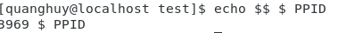
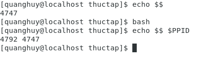
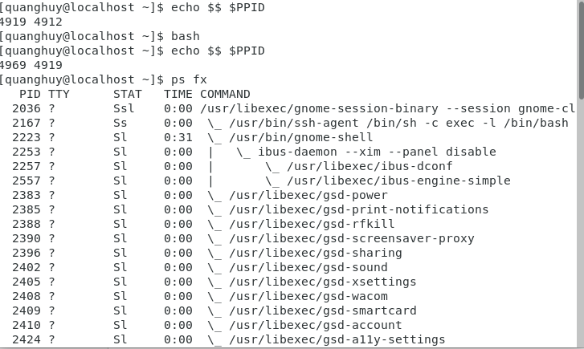

# Quản lý quy trình 
  
   1. **Quản lý quy trình cơ bản**
    
        - **$$ và $ PPID**: Một số biến môi trường shell chứa thông tin về các tiến trình. Biến $$ sẽ giữ ID quy trình hiện tại của bạn và $ 
PPID chứa PID mẹ. Thực ra $$ là một tham số shell và không phải là một biến, bạn không thể gán giá trị cho nó. Dưới đây là một ví dụ.
       
        
       
       - **pidof**: tìm thấy tất cả id quy trình theo tên bằng lệnh pidof.
       - **parent and child**: Các quy trình có mối quan hệ parent-child. Mọi quy trình đều có quy trình mẹ.
Khi bắt đầu một bash mới , bạn có thể sử dụng echo để xác minh rằng pid trước đó có phải là ppid của shell mới 
hay không. Tiến trình con từ phía trên bây giờ là tiến trình cha mẹ.
        - **fork and exec**: Một quá trình bắt đầu một quá trình khác trong hai giai đoạn. Đầu tiên, quá trình này tạo ra một nhánh rẽ của chính nó, một bản sao giống hệt nhau. Sau đó, quá trình được chia nhỏ thực hiện một tệp thi hành để thay thế quá trình được chia nhỏ bằng quá trình con đích.
        
        
         
       - **exec**: Với lệnh execute , bạn có thể thực hiện một quy trình mà không cần tạo quy trình mới. Một trình bao Korn (ksh) được khởi động và đang được thay thế bằng một trình bao bash bằng lệnh thi hành . Pid của bash shell cũng giống như pid của Korn shell . Thoát khỏi shell bash con sẽ đưa tôi trở lại bash cha , không trở lại shell Korn (không tồn tại nữa).
       - **ps**: xem các quy trình 
        
         
        
       - **pgrep**: Tương tự như ps -C, bạn cũng có thể sử dụng pgrep để tìm kiếm một tiến trình theo tên lệnh của nó.
 
  2. **Quy trình báo hiệu**
    
       - **kill**: Lệnh kill sẽ giết (hoặc dừng) một tiến trình.
       - **kill -l**: Hiển thị danh sách các tín hiệu 
       - **kill -1  (SIGHUP)**: Thông thường trên Linux sử dụng tín hiệu đầu tiên SIGHUP (hoặc HUP hoặc 1) để cho biết một quá trình nó sẽ đọc lại tệp cấu hình của nó. Do đó, lệnh kill -1 1 buộc quá trình init (init luôn chạy với pid 1) để đọc lại tệp cấu hình của nó.
       - **kill -15 (SIGTERM)**: Tín hiệu SIGTERM còn được gọi là tiêu chuẩn. Bất cứ khi nào lệnh kill được thực hiện mà không chỉ định tín hiệu, một lệnh kill -15 được giả định.
       - **kill -9 (SIGKILL)**: SIGKILL khác với hầu hết các tín hiệu khác ở chỗ nó không được gửi tới tiến trình mà là đến nhân Linux. Một cú giết -9 cũng được gọi là một cú giết chắc chắn. Kernel sẽ bắn hạ quá trình này . Là một nhà phát triển, bạn không có cách nào để chặn tín hiệu kill -9.
       - **pkill**:  lệnh pkill để kết thúc một tiến trình bằng tên lệnh của nó.
       - **killall**:Lệnh killall sẽ gửi một tín hiệu 15 đến tất cả các tiến trình với một tên nhất định. 
 
  3. **Các giải pháp**
  
       -  Sử dụng ps để tìm kiếm tiến trình init theo tên.
       -  Sử dụng lệnh **who am i** để xác định tên thiết bị đầu cuối của bạn.
       -  Định vị id tiến trình của tất cả các lệnh sleep.
       -  Sử dụng một lệnh để giết tất cả các quá trình sleep.
       -  Sử dụng một tiêu chuẩn tiêu chuẩn để tiêu diệt một trong những quá trình sleep.
  
