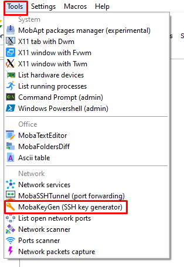
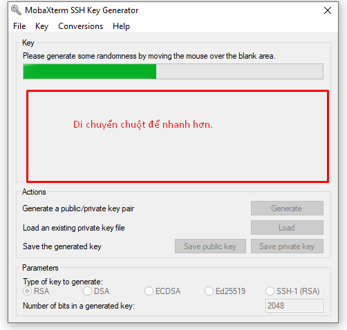

# Lab SSH Keypair

## . Tạo khóa trên server
## Phía server
- Tạo 1 cặp ssh keys
    ```
    ssh-keygen -t rsa
    ```
    
   
   
- Chọn nơi lưu key: (ở đây, ta sẽ để ở thư mục home của root /root/.ssh/id_rsa)

    - Keys được tạo sẽ được lưu tại thư mục của user tạo keys. (Ví dụ: tạo keys bằng tài khoản root thì keys sẽ được lưu tại /root/tên_file).
    - Gõ ENTER để lưu cặp key vào thư mục con .ssh/ nằm trong thự mục home của user hiện hành.

   
   
- Đây là tùy chọn thêm 1 chuỗi mật khẩu , được khuyến nghị để tăng tính bảo mật . Nếu nhập chuỗi passphrase này , bạn sẽ phải gõ thêm chúng bất kỳ lúc nào sử dụng key ( chỉ trừ khi sử dụng phần mềm để SSH đã lưu trữ passphrase ) . Nếu không muốn sử dụng passphrase , có thể ENTER để bỏ qua. Ta nhập passphrase `huy12345`.

   
  
  
