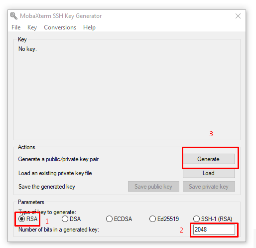
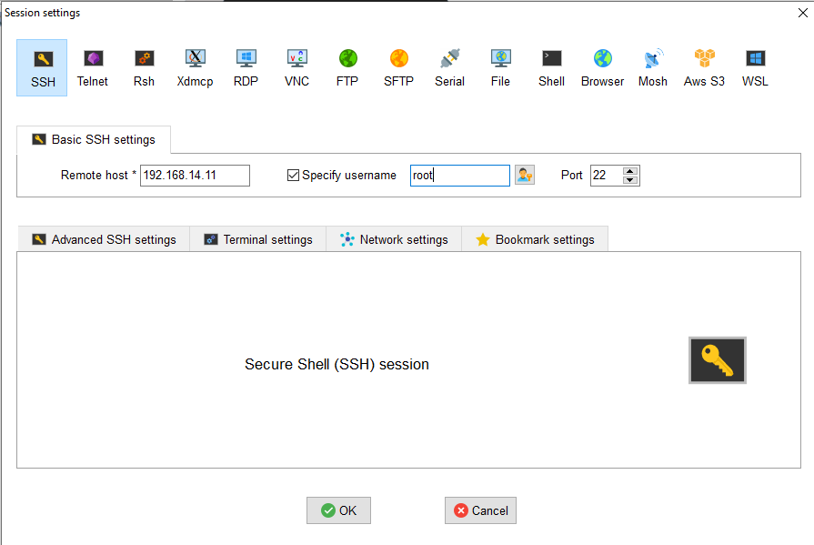
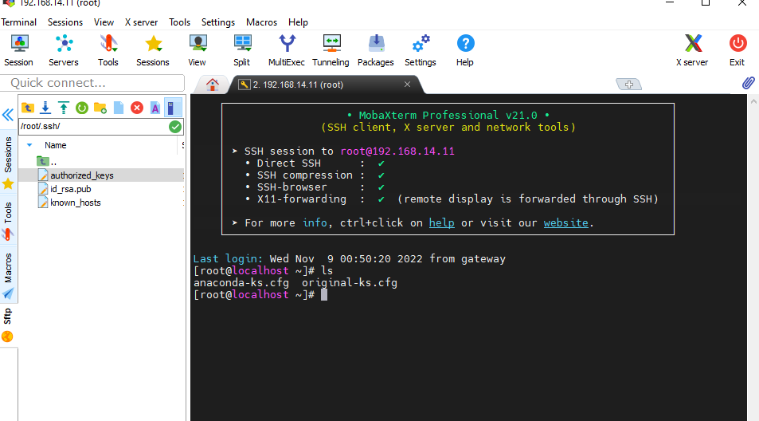
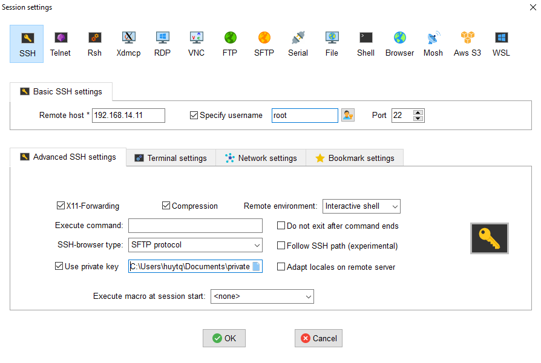
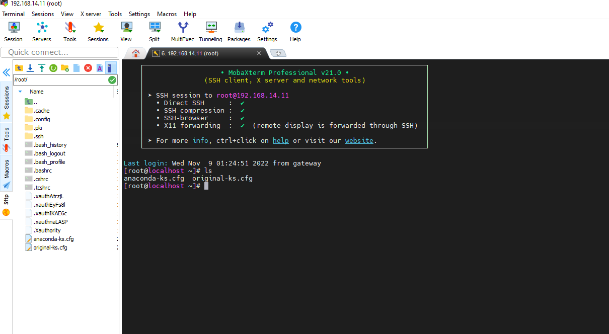

# Key SSH 

## I. Cách tạo SSH key
### Với Window
  
  - Nếu dùng Windows, có thể dùng PuTTY hoặc MobaXterm để gen ssh keys. Ở đây mình dùng MobaXterm. 
  - Mở giao diện của MobaXterm lên, sau đó chọn **Tools** rồi chọn **MobaKeyGen**.
  
     
   
  - Xuất hiện hộp thoại như hình bên dưới, chọn option như hình. Sau đó kích **Generate**.
  
   
   
  - Di chuột liên tục tại khoảng trống.
  
   
  
  - Xuất hiện hộp thoại như sau:
  
   
   
  - Tại đây, có thể nhập passphrase nếu cần thiết. Sau đó chọn **Save private key** để lưu lại key. 
  - Tiếp tục **Save public key** để lưu khóa công khai, khóa này sau đó được tải lên Server.
  
   
   
### Với Linux
   
   - Trên Linux ta sử dụng lệnh sau để tạo key.
   
      `ssh-keygen -t rsa`
   
   - Sau đó, tiến hành nhập đường dẫn lưu key và nhập key passphrase (có thể để trống để lưu tại đường dẫn mặc định hay không dùng key passphrase)
    
   
   
   - Kiểm tra lại đường dẫn 
    
   
   
   - Đổi tên `id_rsa thành `authorized_keys`
   
        ```
        [root@localhost .ssh]# mv id_rsa authorized_keys
        mv: overwrite ‘authorized_keys’? yes

        ```
  -Kiểm tra lại file `authorized_keys`
  
   
  
## II. Cách upload Public key lên Server và connect bằng SSH key

  1. Kết nối với Server bằng username root và password để upload Private key
  
   
   
   Tại giao diện chính của MobaXterm, chọn Session -> SSH. Sau đó tích chọn Secify username và nhập vào tài khoản root. Nhấn OK và nhập mật khẩu root để đăng nhập vào Server
   
  2.  Tại cửa sổ bên trái, ta tìm tới đường dẫn `/root/.ssh/`. Để kiểm tra file `authorized_keys`. 
  
   
   
  3. Sau khi đã có SSH key, việc đăng nhập vào Server sẽ chỉ cần sử dụng Private key có sẵn trong máy mà không cần phải nhập password nữa
  
   
  
  - Chọn Session -> SSH. Nhập vào IP server, tên tài khoản root. Sau đó chọn Advanced SSH settings, tích chọn Use private key và dẫn đến file Private key có trong máy. Cuối cùng chọn OK để đăng nhập.

   
    
  
  


  
