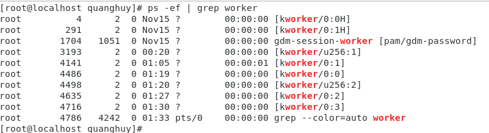

# Các lệnh cơ bản 
  
1. Thoát khỏi trạng thái đăng nhập `exit`, `logout`hoặc sử dụng tổ hợp phím ` CTRL+ALT+DEL`.
    
   
  
2. Khởi động lại hệ thống
  - Sử dụng lệnh `reboot` hoặc `sudo shutdown -r`.
  - Khởi động theo khoảng thời gian: `sudo shutdown -r hh:mm` (hh: là số giờ, mm là số phút). Ví dụ ở đây khởi động lại sau 1 giờ 1 phút.
  
   
  
  - Khởi động sau một khoảng thời gian: `sudo shutdown -r +n` (n là số phút). Ví dụ khởi động sau 5 phút. 

   
   
  - Muốn hủy khởi động: `sudo shutdown -c`.

   

3. Lệnh `ps`: hiển thị các tiến trình   
  
   
   
   trong đó: - PID: process ID.
             - TTY: Loại terminal.
             - TIME: tổng thời gian process đã chạy.
             - CMD: tên của lệnh khởi chạy process.
 - Hiển thị tất cả các tiến trình: `ps -ef` 

   
   
 - Lọc theo người dùng: `ps -e -u username`. (Ở đây username là root) Lệnh này chỉ lọc kết quả và chỉ hiển thị các tiến trình thuộc sở hữu của username được chỉ định.
 
   
   
 - Lọc theo tiến trình: `ps -c name`. Lệnh này tìm kiếm thông qua các tiến trình mà k có tiền tố `-e`.
  
   
   
 - Lọc theo ID tiến trình `ps -ef -p ID`.
 
   
   
- Chuyển kết quả sang grep `ps -ef | grep worker`.
  
   
 
- Hiển thị các cột cụ thể: `ps -e -o pid,uname,pcpu,pmem,comm`.

   

- Sắp xếp các tiến trình theo cách sử dụng: `ps -e --sort=-pcpu -o pid,pcpu,comm`.

   

- Đổi tên tiêu để cột: `ps -e -o pid,pcpu=CPU -o pmem=RAM,comm`

   

- Hiển thị theo cây phân cấp: `ps -e --forest`

   

- Hiển thị các Thread bên trong tiến trình: `ps -p 1729 -l`

   
   
- Hiển thị tất cả các tiến trình root: `ps -f -u root -u root`

   

- Hiển thị các quy trình do người dùng hiện tại sở hữu: `ps -x`

   

- Hiển thị thêm thông tin về các quy trình do người dùng sở hữu: `ps -ux`

   
  
- Hiển thị phiên bản của chương trình đang thực thi: `ps -h`

   
   
- Hiển thị các thread sau các quy trình: `ps -m`
  
   
 
- Hiển thị các thread vs SPID của chúng: `ps -t`

   

- Liệt kê thông tin về các quy trình theo dạng đầy đủ hơn.

   
   
4. `sleep <thoi_gian>` : cho hệ thống ngừng hoạt động trong 1 thời gian.
- Ví dụ: sleep 5 nghĩa là sleep trong 5 giây.
         sleep 0.5 là sleep trong 0.5 giây.
         sleep 2m 30s là sleep trong 2 phút 30 giây.

5. ` useradd <ten_user>` : Thêm 1 user vào hệ thống.
- Ví dụ 1: Lệnh sau sẽ tạo một người dùng ‘tommy‘ với thư mục chính /home/thuctap.
        `useradd -d /home/thuctap tommy`
- Ví dụ 2: Lệnh sau sẽ tạo một người dùng ‘john‘ với userid tùy chỉnh là ‘555‘. 
        `useradd -u 555 john`
6. `passwd  <ten_user>` : cập nhật mật khẩu cho user.
7. `who` : cho biết user nào đang sử dụng hệ thống.
- Xem ai là người đã rời khỏi hệ thống gần đây nhất dùng lệnh `who -b`.
- Để xem danh sách tất cả các quy trình đã bị chết thì sử dụng `who -d`.
- Để xem cấp độ của người dùng hiện tại `who -r`.
- Để lấy danh sách tên người dùng đang đăng nhập và tổng số lượng người dùng sử dụng `who -q`.
- Để xem thông tin đầy đủ của các user `who -a`.
8. `top` : tương tự như Task Manager của Window.
   
   

  - Trong đó: +)Dòng 1: Thời gian hiện tại, thời gian uptime, số lượng người sử dụng, trung bình tải hiển thị thời gian load hệ thống.
              +)Dòng 2: Tổng các tác vụ trên máy chủ, số lượng tác vụ đang chạy, trong trạng thái ngủ, số lượng tác vụ dừng và tiến trình không tồn tại.
              +)Dòng 3: Phần trăm do tiến trình của người dùng sử dụng(us), phần trăm do tiến trình của hệ thống sử dụng(sy),  phần trăm do các tiến trình có mức độ ưu tiên thấp sử dụng(ni), phần trăm CPU đang rảnh(id),  phần trăm CPU để đợi trong khi các tiến trình I/O đang xử lý(wa), phần trăm để xử lý gián đoạn phần cứng (hi), phần trăm để xử lý gián đoạn phần mềm(si), phần trăm do máy ảo sử dụng (st).
              +)Dòng 4: Tổng bộ nhớ hệ thống(đơn vị Kib), bộ nhớ trống, bộ nhớ đã sử dụng, bộ nhớ đệm buffer cache.
              +)Dòng 5: Tổng swap có sẵn(đơn vị Kib), tổng swap còn trống, tổng swap đã sử dụng, bộ nhớ khả dụng.
              +)Bảng chính: ID tiến trình, người dùng, mức độ ưu tiên, mức độ nice, bộ nhớ ảo được sử dụng bởi tiến trình, bộ nhớ “thường trú” mà một tiến trình sử dụng, bộ nhớ có thể chia sẻ, CPU được sử dụng bởi tiến trình theo tỷ lệ phần trăm của 1 cpu, bộ nhớ được sử dụng bởi tiến trình theo tỷ lệ phần trăm, thời gian tiến trình đã được chạy, lệnh.
   - Các tham số trong lệnh top:            
     + `-h` Hiển thị phiên bản hiện tại.
     + `-c` Tham số này chuyển đổi trạng thái cột lệnh từ hiển thị lệnh sang hiển thị tên chương trình và ngược lại.
     + `-d` Chỉ định thời gian trễ khi refresh màn hình.
     + `-o` Sắp xếp theo trường được đặt tên.
     + `-p` Chỉ hiển thị các tiến trình với ID được chỉ định.
     + `-u` Chỉ hiển thị những tiến trình của người dùng được chỉ định.
     +  `-i` Không hiển thị các idle task.      
9.  - Thêm 1 user để sử dụng quyền sudo: `usermod -aG wheel <username>`.
10. - Đăng nhập 1 tài khoản user khác: `su - <username>`.

