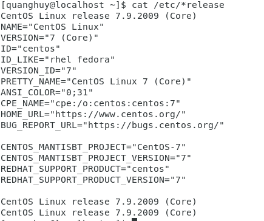
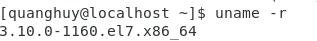
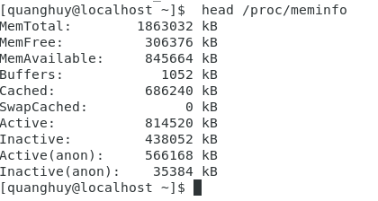
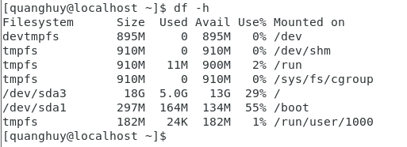
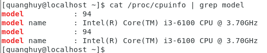

# System Info

 - Thông tin hệ điều hành: `cat /etc/*release`
    
     
 
 - Kernel version: `uname -r`
    
     
   
 - Thông tin bộ nhớ: `head /proc/meminfo`
 
     
    
 - File hệ thống: `df -h`
 
     
 
 - Đếm số lượng CPU: `cat /proc/cpuinfo | grep model`
 
     
    
 - Tên máy chủ: `cat /etc/hostname` Đổi tên máy chủ:  `hostname NEW_NAME`
 - Hệ thống tập tin **proc**: Các /proc hệ thống tập tin chứa các tập tin ảo mà chỉ tồn tại trong bộ nhớ. Hệ thống tập tin này chứa các tập tin và thư mục mà các cấu trúc hạt nhân bắt chước và cấu hình chi tiết. Nó không chứa các tệp thực nhưng có thông tin hệ thống thời gian chạy (ví dụ: bộ nhớ hệ thống, thiết bị được gắn, cấu hình phần cứng, v.v.). 
 Một số tập tin quan trọng trong việc /procbao gồm:
   ```
   /proc/cpuinfo
   /proc/interrupts
   /proc/meminfo
   /proc/mounts
   /proc/partitions
   /proc/version
   /proc/<process-id-#>
   /proc/sys
   ```
   Hệ thống `/proc` tập tin rất hữu ích vì thông tin mà nó báo cáo chỉ được thu thập khi cần thiết và không bao giờ cần lưu trữ trên đĩa.

    
  
