# Text Commands

  - Linux cung cấp các tiện ích cho thao tác tập tin và văn bản như sau:

|Tiện ích|Lệnh|
|-|-|
|Hiển thị nội dung|`cat` và `echo`|
|Chinh sửa nội dung|`sed` và `awk`|
|Tìm theo mẫu|`grep`|

#### 1. Hiển thị nội dung

  - Lệnh `cat` là viết tắt của "*concatenate*" được sử dụng để đọc và in ra nội dung của file. `tac` là lệnh ngược lại của `cat` có chức năng là đọc và in ra nội dung
file theo chiều đảo ngược lại:
      
   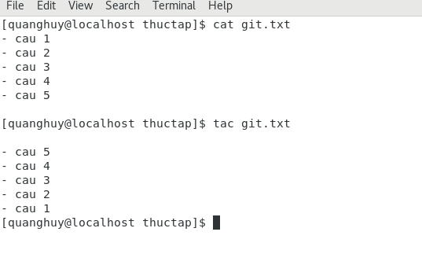
  
  - Lệnh `echo` là lệnh hiển thị text lên màn hình:

   
   
#### 2. Chỉnh sửa nội dung file
##### Lệnh `sed`
  - Là 1 công cụ xử lí văn bản mạnh mẽ, viết tắt của "*stream editor*". Nó sẽ lọc văn bản cũng như thực hiện thay thế trong luồng dữ liệu. Dữ liệu từ nguồn (hoặc luồng) được lấy và di chuyển vào không gian xử lý. Toàn bộ danh sách các thao tác, sửa đổi được áp dụng lên dữ liệu trong không gian xử lý, nội dung cuối cùng được chuyển đến không gian đầu ra tiêu chuẩn (hoặc luồng).

  - Ví dụ : Thay đổi nội dung file:
  
   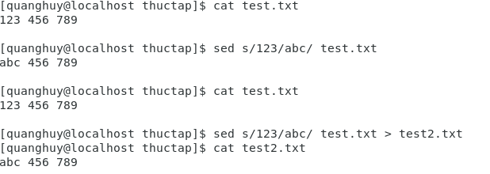
  
  - Ví dụ : Xóa 1 dòng
  
   
  
### Lệnh `awk` 
Được sử dụng để trích xuất và sau đó in nội dung cụ thể của tệp và thường được sử dụng để xây dựng báo cáo. Nó là một tiện ích mạnh mẽ và là ngôn ngữ thông dịch, được sử dụng để thao tác với tệp dữ liệu, truy xuất và xử lý văn bản. Nó hoạt động tốt với các trường (chứa 1 mẩu dữ liệu, thực chất là một cột) và ghi lại (1 tập hợp các trường, thực chất là 1 dòng trong file).

   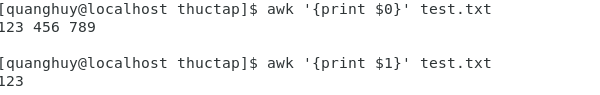

### Lệnh sort
Được sử dụng để sắp xếp lại các dòng của tệp văn bản theo thứ tự tăng dần hoặc giảm dần, theo 1 tiêu chuẩn nào đó(sort key).
  
  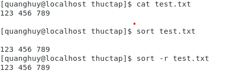

### Lệnh `uniq`
Dùng để xóa các dòng trùng lặp trong tệp văn bản. Nó đòi hỏi các mục trùng lặp phải được loại bỏ liên tiếp.

   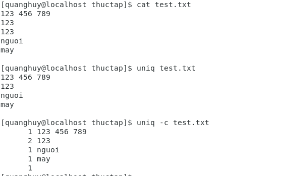

### Lệnh `paste`
Dùng để kết hợp các trường(fields) từ các file khác nhau.

   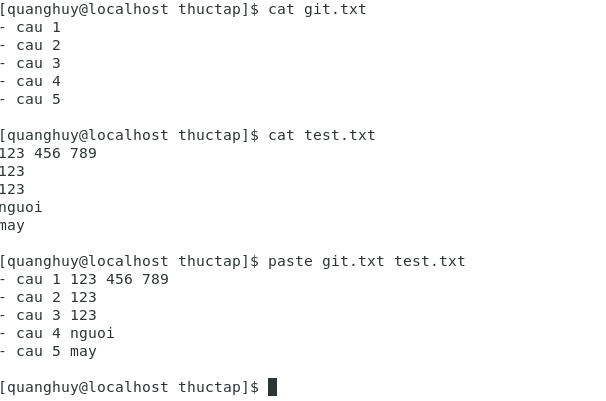

### Lệnh `join`
Dùng để kết hợp 2 file với nhau theo 1 trường chung.

   

## 3. Tìm theo mẫu
### Lệnh `grep`
Được sử dụng rộng rãi như một công cụ tìm kiếm văn bản chính. Nó quét các tệp cho các mẫu chỉ định và có thể được sử dụng với các biểu thức thông thường.

   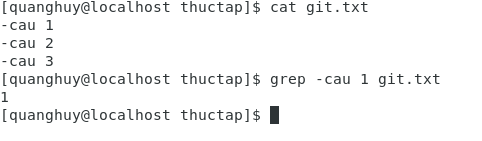

### Lệnh `tr`
Được sử dụng để dịch các kí tự được chỉ định sang kí tự khác hoặc xóa chúng đi.

   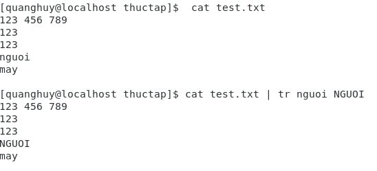

### Lệnh `tee`
Lệnh này sẽ lấy đầu ra của bất kì lệnh nào và trong lúc gửi ra đầu ra tiêu chuẩn, nó sẽ lưu vào 1 file.

   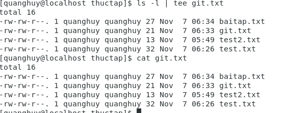

### Lệnh `wc`(Word count)
Lệnh này đếm số lượng dòng(`-l`), từ(`-w`) và ký tự(`-c`) trong một tệp hoặc danh sách các tệp.

   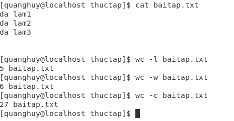

### Lệnh `cut`
Sử dụng để trích xuất các cột trong tệp. Dấu phân cách cột mặc định sẽ là kí tự `tab`, hoặc có thể được tùy chỉnh bằng câu lệnh.

   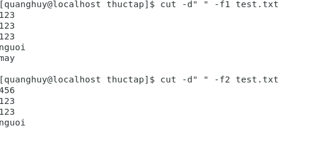

### Lệnh `head`
In ra vài dòng đầu tiên của file(mặc định là 10). Có thể thay đổi được qua option `-n số_dòng`

   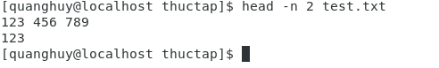

### Lệnh `tail`
In ra vài dòng cuối cùng của file(mặc định là 10). Có thể thay đổi được qua option `-n số_dòng`

   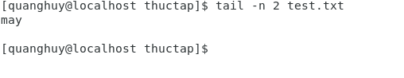

  
