# Cài đặt máy ảo Centos 7 trên VMWare và tìm hiểu LINUX

### Cài đặt máy ảo Centos 7

#### Các bước thực hiện cài đặt:
  1. Khởi chạy VMWare workstation, sau đó chọn **Create a New Virtual Machine**. Sau đó bấm **Next**.
  
   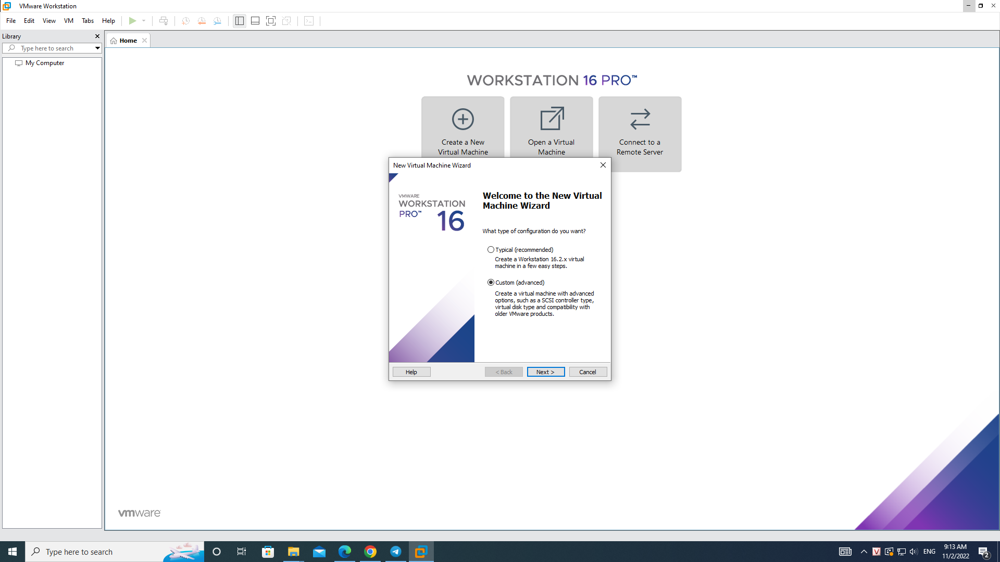
 
 2. Xuất hiện cửa sổ rồi bấm **Next**.
 
   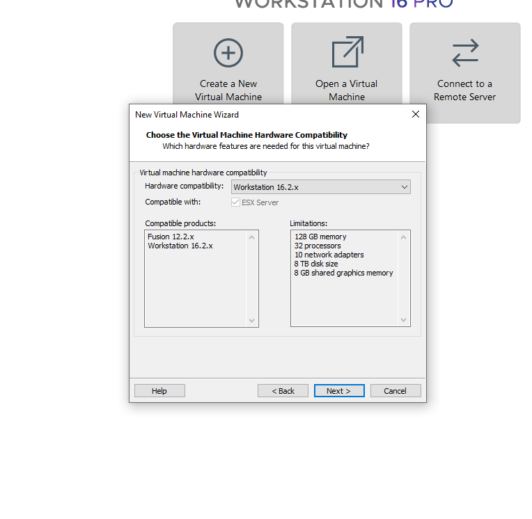
 
 3. Cửa sổ xuất hiện chọn **Installer disc image files(iso)**, sau đó chỉ dẫn đến ổ đĩa cài Centos bằng cách chọn **Browse..**. Sau đó bấm **Next**.
    
   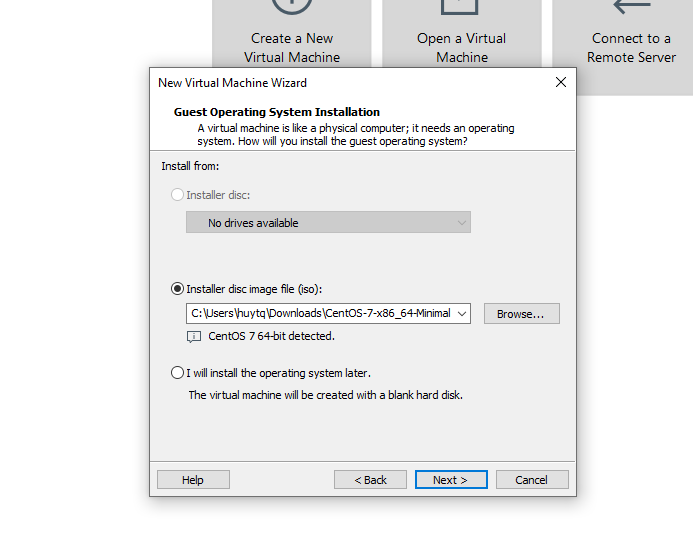
  
 4. Lựa chọn tên cho máy ảo và vị trí lưu của nó. Bấm **Next**.
      
   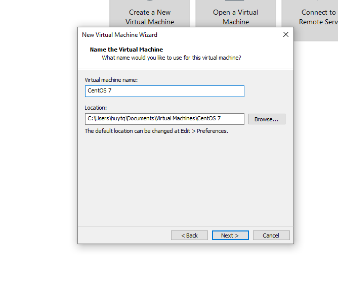
   
 5. Lựa chọn số lượng bộ xử lý
  
   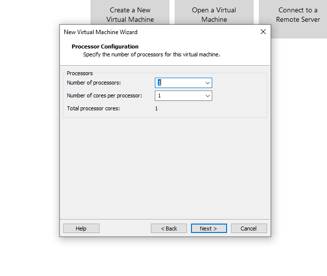
   
 6. Lựa chọn bộ nhớ của. Sau đó bấm **Next**.
  
   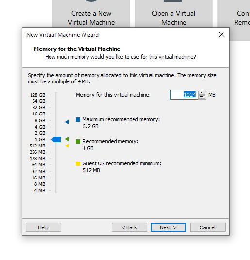
   
 7. Lựa chọn dạng kết nối. Sau đó bấm **Next**.
 
   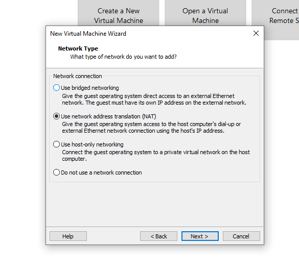
   
 8. Lựa chọn loại điều khiển. Sau đó bấm **Next**.
 
   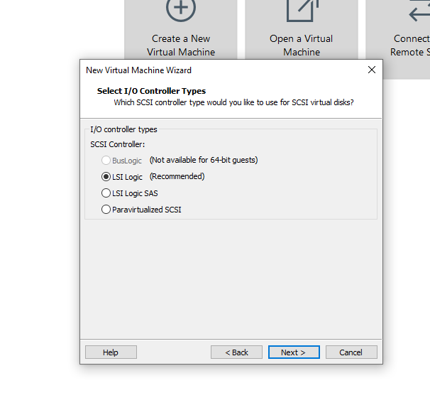

9. Lựa chọn loại đĩa. Sau đó bấm **Next**.

   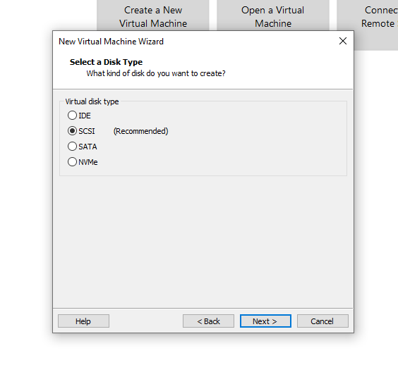

10. Chọn loại ổ đĩa muốn sử dụng. Sau đó bấm **Next**.

   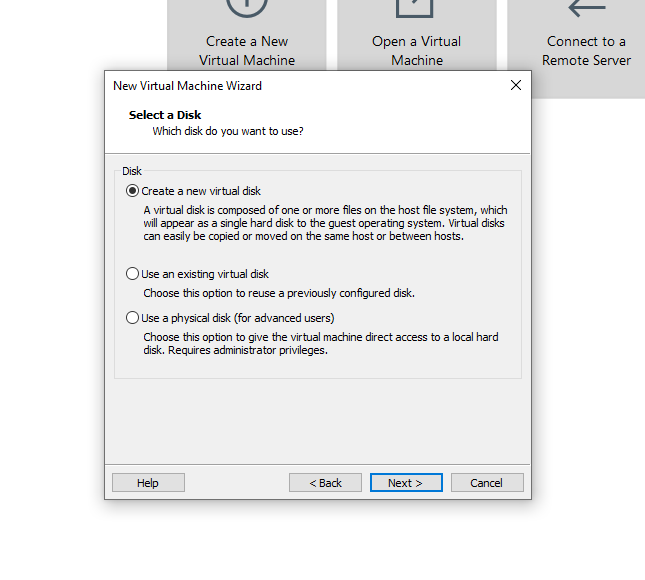

11. Chọn kích thước ổ đĩa.Sau đó bấm **Next**.

   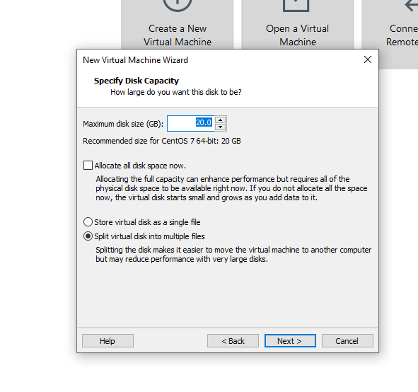

12. Chọn tên file cho ổ đĩa.Sau đó bấm **Next**.

   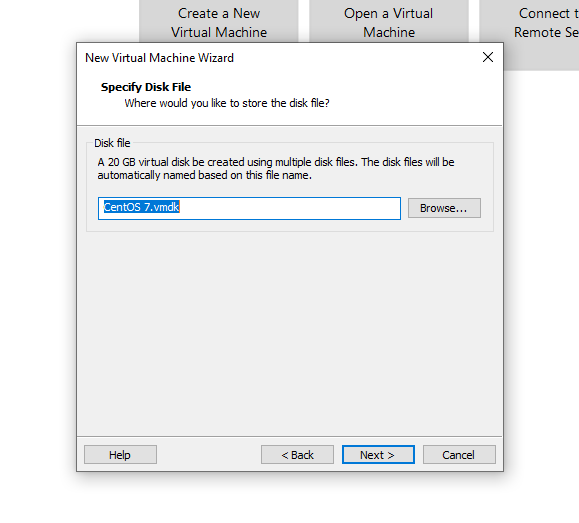

13. Xem lại tổng quan cấu hinh của máy ảo. Rồi bấm **Finish**.

   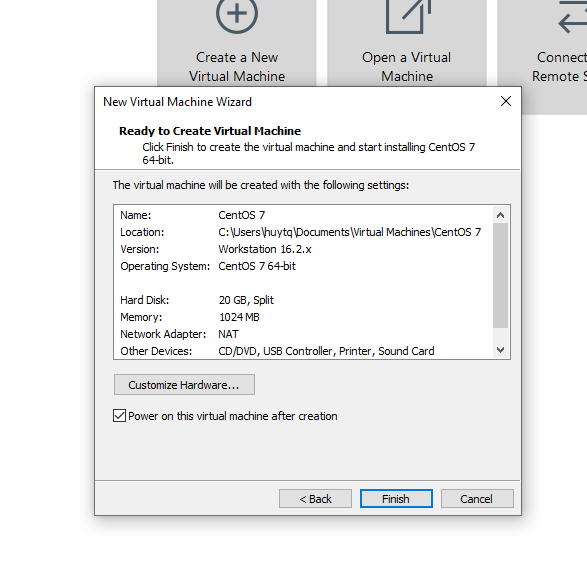
   
14. Đang tiến hành cài đặt                       

   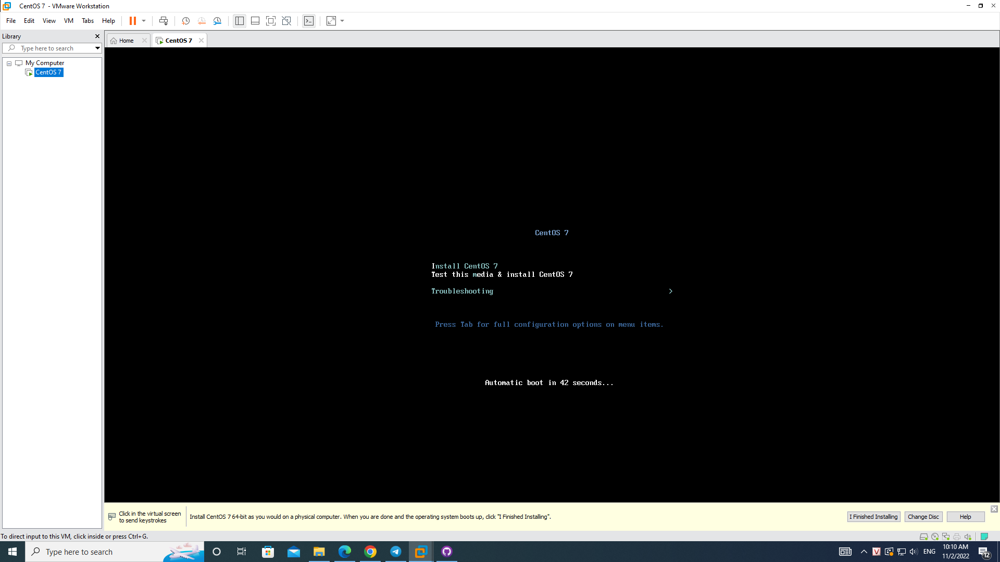

15. Quá trình cài đặt Centos 

   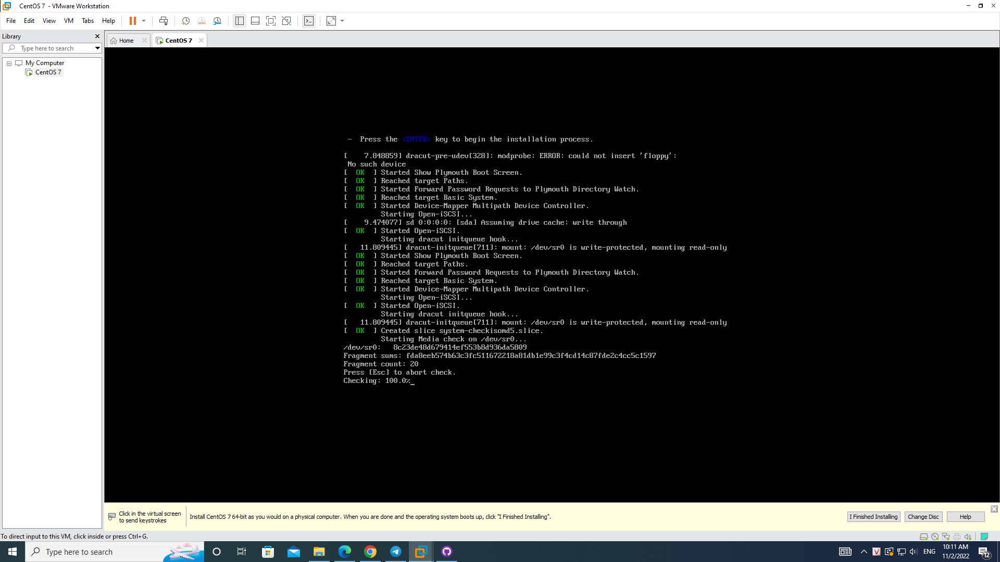

16. Hoàn thành quá trình cài đặt Centos. Sau đó bấm **Rebot**.

   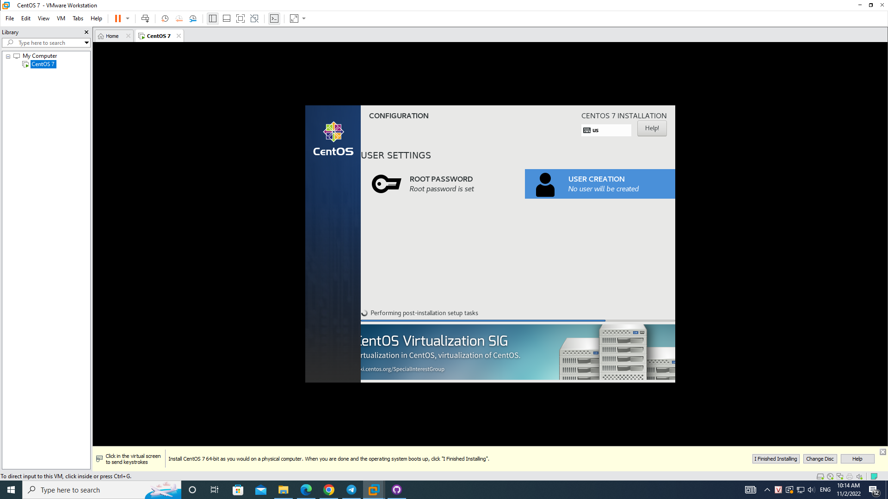

17. Giao diện trang chủ của Centos.

   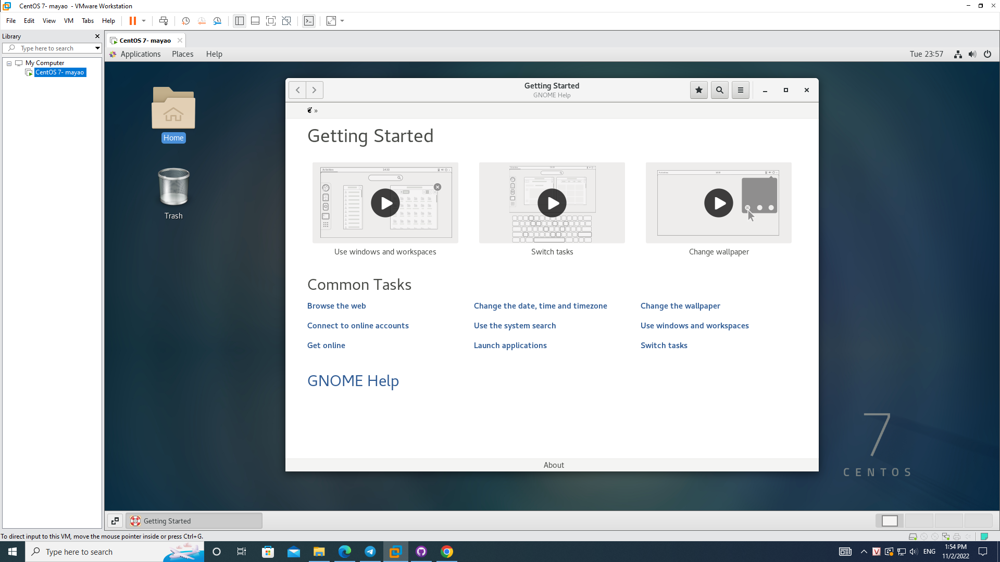
   
   
### Tìm hiểu về LINUX

                          
               
                  
                
  
