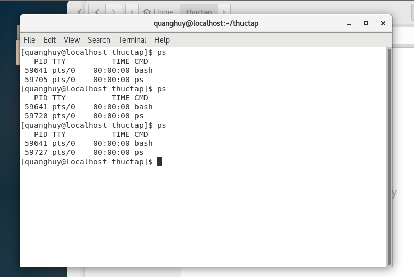

# Cài đặt máy ảo Centos 7 trên VMWare và tìm hiểu LINUX

### Cài đặt máy ảo Centos 7

#### Các bước thực hiện cài đặt:
  1. Khởi chạy VMWare workstation, sau đó chọn **Create a New Virtual Machine**. Sau đó bấm **Next**.
  
   
 
 2. Xuất hiện cửa sổ rồi bấm **Next**.
 
   
 
 3. Cửa sổ xuất hiện chọn **Installer disc image files(iso)**, sau đó chỉ dẫn đến ổ đĩa cài Centos bằng cách chọn **Browse..**. Sau đó bấm **Next**.
    
   
  
 4. Lựa chọn tên cho máy ảo và vị trí lưu của nó. Bấm **Next**.
      
   
   
 5. Lựa chọn số lượng bộ xử lý
  
   
   
 6. Lựa chọn bộ nhớ của. Sau đó bấm **Next**.
  
   
   
 7. Lựa chọn dạng kết nối. Sau đó bấm **Next**.
 
   
   
 8. Lựa chọn loại điều khiển. Sau đó bấm **Next**.
 
   

9. Lựa chọn loại đĩa. Sau đó bấm **Next**.

   

10. Chọn loại ổ đĩa muốn sử dụng. Sau đó bấm **Next**.

   

11. Chọn kích thước ổ đĩa.Sau đó bấm **Next**.

   

12. Chọn tên file cho ổ đĩa.Sau đó bấm **Next**.

   

13. Xem lại tổng quan cấu hinh của máy ảo. Rồi bấm **Finish**.

   
   
14. Đang tiến hành cài đặt                       

   

15. Quá trình cài đặt Centos 

   

16. Hoàn thành quá trình cài đặt Centos. Sau đó bấm **Rebot**.

   

17. Giao diện trang chủ của Centos.

   
   
   
### Tìm hiểu về LINUX
#### I. Những lệnh liên quan đến hệ thống
        
   1. **exit**: thoát khỏi cửa sổ dòng lệnh.
   2. **reboot**: khởi động lại hệ thống.
   3. **halt**: tắt máy
        - Phải ở quyền root.
        - Không nên dùng, bị treo máy ảo.
   4. **startx**: khởi động chế độ xwindows từ cửa sổ terminal.
   5. **mount**: gắn hệ thống tập tin từ 1 thiết bị lưu trữ vào cây thư mục chính.
   6. **umount**: unmount tập tin khỏi cây thư mục chính.
   7. **ps**: kiểm tra hệ thống tiến trình đang chạy.
        
   
   
   8. **kill**: Sẽ giết (hoặc dừng) một tiến trình.
   
   
   
   9. **top**: Hiển thị danh sách các tiến trình đang chạy và lượng CPU
   
   
   
   10. **pstree**: Hiển thị dưới dạng cây
    
   
   
   
   11. **cat /etc/*release**: xem thông tin hệ điều hành
   
   
   
   12. **uname -r**:  Xem phiên bản Kernel

   
   
   13. **head /proc/meminfo**: Xem thông tin bộ nhớ

   
   
   14. **df -h**: Xem file hệ thống
   
   
   
   15. **cat /proc/cpuinfo | grep model**: Đêm sổ lượng CPU
   
   
  
   16. **ifconfig**: Xem địa chỉ IP của máy
   
   
   
#### II. Các lệnh liên quan đến tệp và thư mục
 
   1. ```ls```: liệt kê các tệp và thư mục trong thư mục hiện hành
     
       
      
   2. ```pwd```: xuất đường dẫn của thư mục đang làm việc
     
       
      
   3.  ```cd```: thay đổi thư mục làm việc đến 1 thư mục mới
     
       
      
   4.  ```mkdir```: tạo thư mục mới
      
       
      
   5.  ```rmdir```: xóa thư mục rỗng
  
       
      
   6.  ```cp```: copy 1 hay nhiều tập tin đến thư mục mới
  
       
       
   7.  ```mv```: đổi tên hay di chuyển tập tin, thư mục
   
       
   
   8.  ```rm```: xóa tập tin hoặc thư mục
  
       
       
   9.  ```touch```: tạo 1 tệp tin 
   
       
   
   10. ```cat```: xem nội dung tệp tin
   
       
   
   11. ```vi```: chỉnh sửa nội dung file text với trình soạn thảo văn bản vi
   12.  ```chmod```: thay đổi quyền của tệp tin
   13.   ```chroot```: thay đổi quyền của thư mục (tương tự chmod)
   14.   ```chown```: thay đổi quyền sở hữu của tệp tin
    
#### Các lệnh liên quan đến cài đặt 

   1. ```gunzip```: chuyển file .tar.gz về file .tar

   2. ```tar -xvf```: giải nén file .tar

   3. ```apt install```: cài đặt những ứng dụng có trong kho dựa trên Debian

   4. ```yum install```: cài đặt những ứng dụng có trong kho dựa trên RPM

   
    
        
        


                          
               
                  
                
  
